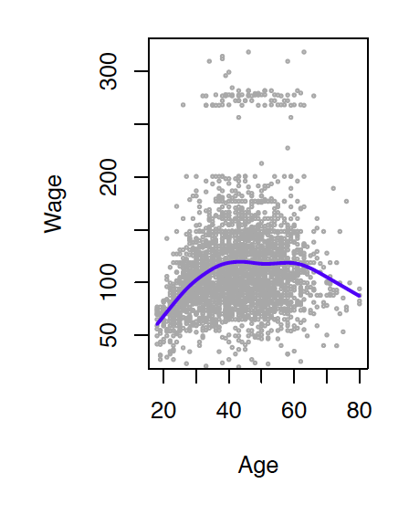

```{r child = "setup.Rmd"}
```

layout: true

<div class="my-footer">
  <span>
  Dr. Lucy D'Agostino McGowan
</span>
</div> 

---

```{r packages, echo=FALSE, message=FALSE, warning=FALSE}
library(tidyverse)
```

## `r emo::ji("wave")`

##  Lucy D'Agostino McGowan

<i class="fa fa-envelope"></i> &nbsp; [mcgowald@wfu.edu](mailto:mcgowald@wfu.edu) <br>
<i class="fa fa-university"></i> &nbsp; Manchester 342 <br>
<i class="fa fa-calendar"></i> &nbsp; Wed 10:00-11:00a, Thu 10:00-11:00a

---

class: middle, center

Everything you will need will be posted at:

# [bit.ly/sta-363-s20](http://bit.ly/sta-363-s20)

---

# Statistical Learning Problems

.pull-left[
* Identify risk factors for breast cancer
]

.pull-right[

]

.my-footer[.small[Dr. Lucy D'Agostino McGowan _adapted from slides by Hastie & Tibshirani_
]]

---

# Statistical Learning Problems

.pull-left[
<font color="grey">
* Identify risk factors for breast cancer
</font>
* Customize an email spam detection system
]

.pull-right[
* **Data**: 4601 labeled emails sent to _George_ who works at _HP Labs_ 
* **Input features**: frequencies of words and punctuation
]

| george | you | hp | free | ! | edu | remove
--|-----|-----|----|-----|-----|----|------
**spam** | 0.00 | 2.26 | 0.02 | 0.52 | 0.51 | 0.01 | 0.28
**email** | 2.27 | 1.27 | 0.90 | 0.07 | 0.11 | 0.29 | 0.01

.my-footer[.small[Dr. Lucy D'Agostino McGowan _adapted from slides by Hastie & Tibshirani_
]]

---


# Statistical Learning Problems

.pull-left[
<font color="grey">
* Identify risk factors for breast cancer
* Customize an email spam detection system
</font>
* Identify numbers in handwritten zip code
]

.pull-right[

]

.my-footer[.small[Dr. Lucy D'Agostino McGowan _adapted from slides by Hastie & Tibshirani_
]]

---

# Statistical Learning Problems

.pull-left[
<font color="grey">
* Identify risk factors for breast cancer
* Customize an email spam detection system
* Identify numbers in handwritten zip code
</font>
* Establish the relationship between variables in population survey data
]

.pull-right[
Income survey data for males from the central Atlantic region of US, 2009

</img>

]

.my-footer[.small[Dr. Lucy D'Agostino McGowan _adapted from slides by Hastie & Tibshirani_
]]

---

# Statistical Learning Problems

.pull-left[
<font color="grey">
* Identify risk factors for breast cancer
* Customize an email spam detection system
* Identify numbers in handwritten zip code
* Establish the relationship between variables in population survey data
</font>
* Classify pixels of an image
]


.pull-right[
</img>
.small[
Usage $\in$ {red soil, cotton, vegetation stubble, mixture, gray soil, damp
gray soil}
]
]

.my-footer[.small[Dr. Lucy D'Agostino McGowan _adapted from slides by Hastie & Tibshirani_
]]

---

## `r emo::ji("v")` types of statistical learning

.large[
* Supervised Learning
* Unsupervised Learning
]
---

## Supervised Learning

.my-footer[.small[Dr. Lucy D'Agostino McGowan _adapted from slides by Hastie & Tibshirani_
]]

* **outcome variable**: $Y$, (dependent variable,
response, target)
--

* **predictors**: vector of $p$ predictors, $X$, (inputs,
regressors, covariates, features, independent variables)
--

* In the **regression problem**, $Y$ is quantitative (e.g price,
blood pressure)
--

* In the **classification** problem, $Y$ takes values in a finite,
unordered set (survived/died, digit 0-9, cancer class of
tissue sample)
--

* We have **training data** $(x_1, y_1), \dots, (x_N, y_N)$. These are
observations (examples, instances) of these measurements

---

## Supervised Learning

.question[
What do you think are some objectives here?
]

--

### Objectives

* Accurately predict unseen test cases
* Understand which inputs affect the outcome, and how
* Assess the quality of our predictions and inferences

.my-footer[.small[Dr. Lucy D'Agostino McGowan _adapted from slides by Hastie & Tibshirani_
]]
---

## Unsupervised Learning

.my-footer[.small[Dr. Lucy D'Agostino McGowan _adapted from slides by Hastie & Tibshirani_
]]

* No outcome variable, just a set of predictors (features)
measured on a set of samples
--

* objective is more fuzzy -- find groups of samples that
behave similarly, find features that behave similarly, find
linear combinations of features with the most variation
--

* difficult to know how well your are doing
--

* different from supervised learning, but can be useful as a
pre-processing step for supervised learning


---
class: center, middle

# Let's go!

---

## Create a GitHub account

Go to https://github.com/, and create an account (unless you already have one). Tips for selecting a username:<sup>1</sup>

.small[
- Incorporate your actual name! People like to know who they’re dealing with. Also makes your username easier for people to guess or remember.
- Reuse your username from other contexts if you can, e.g., Twitter or Slack.
- Pick a username you will be comfortable revealing to your future boss.
- Shorter is better than longer.
- Be as unique as possible in as few characters as possible. In some settings GitHub auto-completes or suggests usernames.
- Make it timeless. Don’t highlight your current university, employer, or place of residence.
- Avoid words laden with special meaning in programming, like `NA`.
]

.footnote[ [1] Source: [Happy git with R](http://happygitwithr.com/github-acct.html#username-advice) by Jenny Bryan.]

<font color="#E34132">
Once done, place a green sticky on your laptop. If you have questions, place a pink sticky.
</font>

---

## Join RStudio.cloud

Go to [bit.ly/sta-363-s20-rstudio-join](http://bit.ly/sta-363-s20-rstudio-join) and sign up.

<font color="#E34132">
Once done, place a green sticky on your laptop. If you have questions, place a pink sticky.
</font>
.my-footer[
  <font size="2"> Slides adapted from <a href="https://github.com/Sta199-S18/website" target="_blank">Dr. Mine Çetinkaya-Rundel</a> by Dr. Lucy D'Agostino McGowan</font>
]
---

## <i class="fas fa-laptop"></i> Create a classification model

- Once you log on to RStudio Cloud, click on this course's workspace "STA 363 - S20" then click "Projects"
- You should see a project called `zipcode`, click it.
- In the Files pane in the bottom right corner, spot the file called `zipcode.Rmd`. Open it, and then click on the "Knit" button. *You will likely see an pop-up error, click "Try Again"*
- Go back to the file and change your name on top (in the `yaml` -- we'll talk about what this means later) and knit again.
- Then, scroll to the `recipe` chunk, below **First we create a recipe**. Instead of creating a model to classify whether the number is **0** or not, create a model to predict whether the number is **1**. Knit again & voila!

<font color="#E34132">
Once done, place a green sticky on your laptop. If you have questions, place a pink sticky.
</font>

---

## Let's take a tour - class website

.center[

]

- Concepts introduced:
  - How to find slides
  - How to find assignments
  - How to find RStudio Cloud
  - How to get help
  - How to find policies
---

class: center, middle

# Course structure and policies
---

## Class meetings

- Interactive
- Some lectures, lots of learn-by-doing
- Bring your laptop to class every day

---

## Diversity & Inclusiveness:

- Intent: Students from all diverse backgrounds and perspectives be well-served by this course, that students' learning needs be addressed both in and out of class, and that the diversity that the students bring to this class be viewed as a resource, strength and benefit. It is my intent to present materials and activities that are respectful of diversity: gender identity, sexuality, disability, age, socioeconomic status, ethnicity, race, nationality, religion, and culture. Let me know ways to improve the effectiveness of the course for you personally, or for other students or student groups.
- If you have a name and/or set of pronouns that differ from those that appear in your official Wake Forest records, please let me know!

---

## Diversity & Inclusiveness: 

- If you feel like your performance in the class is being impacted by your experiences outside of class, please don't hesitate to come and talk with me. I want to be a resource for you. If you prefer to speak with someone outside of the course, your academic dean is an excellent resource. 
- I (like many people) am still in the process of learning about diverse perspectives and identities. If something was said in class (by anyone) that made you feel uncomfortable, please talk to me about it.

---

## Disability Policy

Students with disabilities who believe that they may need accommodations in the class are encouraged to contact Learning Assistance Center & Disability Services at 336-758-5929 or [lacds@wfu.edu](mailto:lacds@wfu.edu) as soon as possible to better ensure that such accommodations are implemented in a timely fashion. 

---

## How to get help

All course discussion will be via GitHub: [sta-363-s20/community](https://github.com/sta-363-s20/community) 
    
- See course policies for tips on posting questions.
- For personal and grade related questions, use email.

---
## How to get help 

- Go to https://github.com/sta-363-s20/community and bookmark this page.
- In the issues tab find the issue created by Dr. D'Agostino McGowan (`@LucyMcGowan`) and click on it to view it.
- Respond to it with a hello, or something else. Feel free to add some code formatted text, inline surrounded by a single backtick or on a new line surrounded by three backtics, or a hyperlink. Or try bolding or italicizing. You could also tag someone if you know their GitHub username. Your post doesn't have to be meaningful.
- Hit Comment when you're done.
- Read the "How to get help" section on the course policies page.

---

## How to get help

#### Math & Stats center

* Located in Kirby Hall 117
* Make an appointment:  [https://mathandstatscenter.wfu.edu/](https://mathandstatscenter.wfu.edu/)

---

## Academic integrity

Adhere to the Wake Forest Honor Code. Academic dishonesty will not be tolerated.

---

## Sharing/reusing code

* There are many online resources for sharing code (for example, StackOverflow) - you **may** use these resources but **must explicitly cite** where you have obtained code (both code you used directly and "paraphrased" code / code used as inspiration). Any reused code that is not explicitly cited will be treated as plagiarism.
* You **may** discuss the content of assignments with others in this class. If you do so, please acknowledge your collaborator(s) at the top of your assignment, for example: "Collaborators: Gertrude Cox, Florence Nightingale David". Failure to acknowledge collaborators will result in a grade of 0. You **may not** copy code and/or answers **directly** from another student. If you copy someone else's work, both parties will receive a grade of 0.
* Rather than copying someone else's work, ask for help. You are not alone in this course!

---

## Course components:


- Application exercises: Usually start in class and finish in teams by the next class period, check/no check
- Reading assessments: no make-ups, lowest two will be dropped
- Homework: on your own, lowest score dropped
- Lab: start in class, lowest score dropped
- Exams: 2 in class midterms, 1 take home midterm

---

## Grading


Component             | Weight
----------------------|----------------
Participation & application exercises  | 5%
Reading assessments   | 10%
Homework              | 10%
Labs                  | 10%
Midterm exam 1        | 25%
Midterm exam 2        | 25%
Midterm exam 3        | 15%

- Class attendance is a firm expectation; frequent absences or tardiness 
will be considered a legitimate cause for grade reduction.

---

## Late/missed work policy


- Late work policy for homework and lab assignments:
    - late, but within 24 hours of due date/time: -50%
    - any later: no credit
- Late work will not be accepted for the take-home Midterm exam 3.

---

## Other policies

- Please refrain from texting or using your computer for anything other than coursework during class.
- You must be in class on a day when you're scheduled to present, there are no make ups for presentations.
- Regrade requests must be made within 1 week of when the assignment is returned.

---

## Intros

- name
- major / intended major
- what you hope to get out of this class OR fun fact

---

## RStudio Cloud

- If you had issues creating your RStudio Cloud account, opening the project, or running the analysis, stick around to try it again.
    - Go to [bit.ly/sta-363-s20-rstudio-join](http://bit.ly/sta-363-s20-rstudio-join) and sign up.
- If RStudio Cloud worked for you and you were able to run the analysis, you're free to leave.