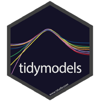

```{r child = "setup.Rmd"}
```

layout: true
  
<div class="my-footer">
<span>
 </img> Slides adapted from <a href="https://datasciencebox.org" target="_blank">datasciencebox.org</a> by Dr. Lucy D'Agostino McGowan
</span>
</div> 

---

## Agenda

- Demo: A reproducible data analysis
- R and RStudio
- R Markdown
- Git and GitHub
- Recap

---


class: center, middle

# A reproducible data analysis

---

## Let's talk about burritos!

<iframe src="https://giphy.com/embed/6587R2Pda6iFW" width="853" height="480" frameBorder="0" class="giphy-embed" allowFullScreen></iframe><p><a href="https://giphy.com/gifs/burrito-6587R2Pda6iFW">via GIPHY</a></p>

---

## Recap: What did we just do?

- Locate a repository on **GitHub**
- Clone and open the project in **RStudio**
- Run the analysis using **R Markdown**
- Edit the analysis to exclude reviews from "Other" reviewers using **R** syntax
- Re-run the analysis using **R Markdown**

---

## Toolkit


- Scriptability $\rightarrow$ R
- Literate programming (code, narrative, output in one place) $\rightarrow$ R Markdown
- Version control $\rightarrow$ Git / GitHub

---

class: center, middle

# R and RStudio

---

## What is R/RStudio?

- R is a statistical programming language
- RStudio is a convenient interface for R (an integreated development environment, IDE)
- At its simplest:<sup>➥</sup>
    - R is like a car’s engine
    - RStudio is like a car’s dashboard

```{r fig.align="center", echo=FALSE}
knitr::include_graphics("img/02/engine-dashboard.png")
```

.footnote[
➥ Source: [Modern Dive](https://moderndive.com/)
]

---

## Let's take a tour - R / RStudio

.center[

]

Concepts introduced:

- Console
- Using R as a calculator
- Environment
- Loading and viewing a data frame
- Accessing a variable in a data frame
- R functions

---

## R essentials

A short list (for now):

- Functions are (most often) verbs, followed by what they will be applied to in parantheses:

```{r eval=FALSE}
do_this(to_this)
do_that(to_this, to_that, with_those)
```

--

- Columns (variables) in data frames are accessed with `$`:

```{r eval=FALSE}
dataframe$var_name
```

--

- Packages are installed with the `install.packages` function and loaded with the `library` function, once per session:

```{r eval=FALSE}
install.packages("package_name")
library(package_name)
```

---

## tidyverse

.pull-left[

]

.pull-right[
.center[
[tidyverse.org](https://www.tidyverse.org/)
]

- The tidyverse is an opinionated collection of R packages designed for data analysis and data science. 
- All packages share an underlying philosophy and a common grammar. 
]

---


## tidymodels

.pull-left[

]

.pull-right[
.center[
[tidyverse.org](https://www.tidyverse.org/)
]

- tidymodels is an opinionated collection of R packages designed for modeling and statistical analysis.
- All packages share an underlying philosophy and a common grammar. 
]

---

class: center, middle

# R Markdown

---


## R Markdown

- Fully reproducible reports -- each time you knit the analysis is run from the beginning
- Simple markdown syntax for text
- Code goes in chunks, defined by three backticks, narrative goes outside of chunks

---

## Let's take a tour - R Markdown


.center[

]

Concepts introduced:

- Knitting documents
- R Markdown and (some) R syntax

---

## R Markdown help

.pull-left[
.center[
[R Markdown cheat sheet](https://github.com/rstudio/cheatsheets/raw/master/rmarkdown-2.0.pdf)
]

]
.pull-right[
.center[
Markdown Quick Reference  
`Help -> Markdown Quick Reference`
]

]

---

## Workspaces

Remember this, and expect it to bite you a few times as you're learning to work 
with R Markdown: The workspace of your R Markdown document is separate from the Console!

- Run the following in the console

.small[
```{r eval = FALSE}
x <- 2
x * 3
```
]

--
.question[
All looks good, eh?
]

--

- Then, add the following chunk in your R Markdown document

.small[
```{r eval = FALSE}
x * 3
```
]
--

.question[
What happens? Why the error?
]

---

## How will we use R Markdown?

- Every assignment / report / project / etc. is an R Markdown document
- You'll always have a template R Markdown document to start with
- The amount of scaffolding in the template will decrease over the semester

---
class: center, middle

# Git and GitHub

---

## How do we collaborate?

- The statistical programming language we'll use is R
- The software we use to interface with R is RStudio
- But how do I get you the course materials that you can build on for your assignments?
    + Hint: I'm not going to email you documents, that would be a mess!
  
---

## Version control

- We introduced GitHub as a platform for collaboration
- But it's much more than that...
- It's actually desiged for version control

---

## Versioning


---

## Versioning

with human readable messages


---

## Why do we need version control?


---

# Git and GitHub tips

- Git is a version control system -- like “Track Changes” features from Microsoft Word on steroids. GitHub is the home for your Git-based projects on the internet -- like DropBox but much, much better).
--

- There are millions of git commands -- ok, that's an exaggeration, but there are a lot of them -- and very few people know them all. 99% of the time you will use git to add, commit, push, and pull.
--

- We will be doing Git things and interfacing with GitHub through RStudio, but if you google for help you might come accross methods for doing these things in the command line -- skip that and move on to the next resource unless you feel comfortable trying it out.
--

- There is a great resource for working with git and R: [happygitwithr.com](http://happygitwithr.com/). Some of the content in there is beyond the scope of this course, but it's a good place to look for help.

---

## Let's take a tour -- Git / GitHub

.center[

]

Concepts introduced:

- Connect an R project to Github repository
- Working with a local and remote repository
- Committing, Pushing and Pulling

There is just a bit more of GitHub that we'll use in this class, but for today this is enough.

---

class: center, middle

# Recap

---

## Recap

Can you answer these questions?

- What is reproducible data analysis, and why do we care?
- What is version control, and why do we care?
- What is R vs RStudio?
- What is git vs GitHub (and do I need to care)?

---
