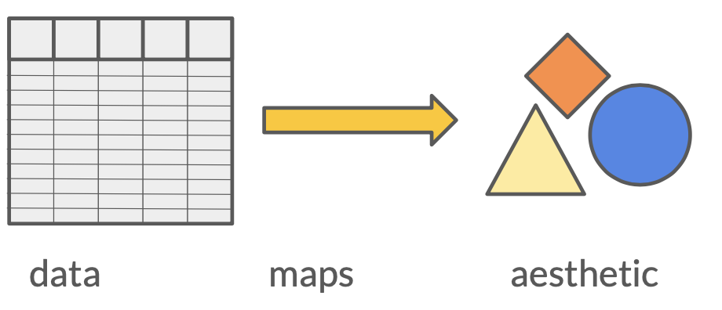
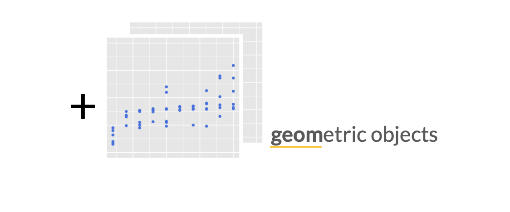
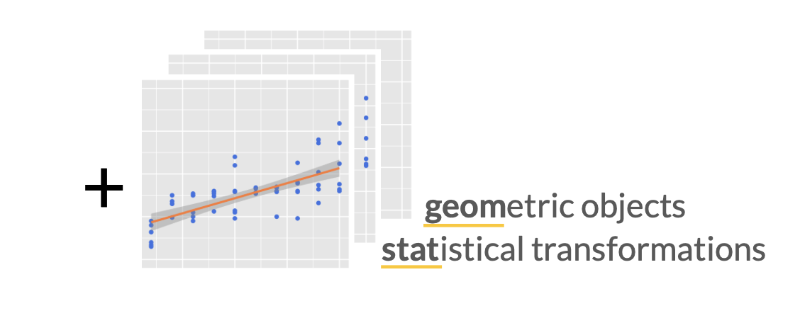
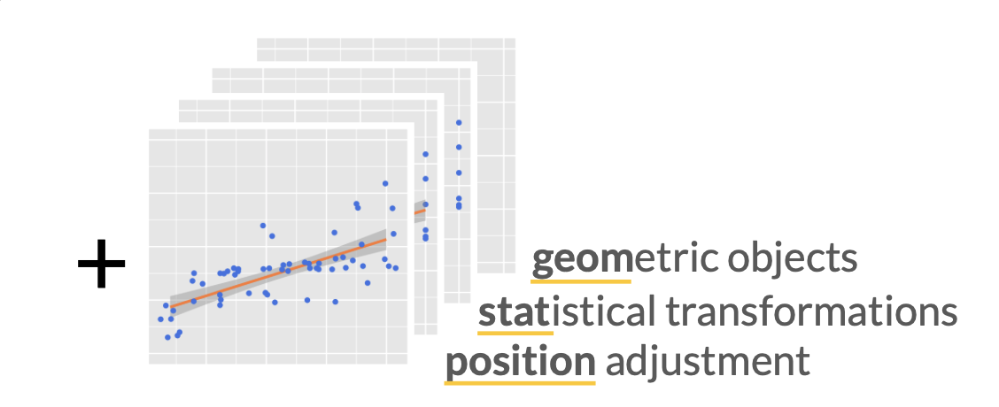
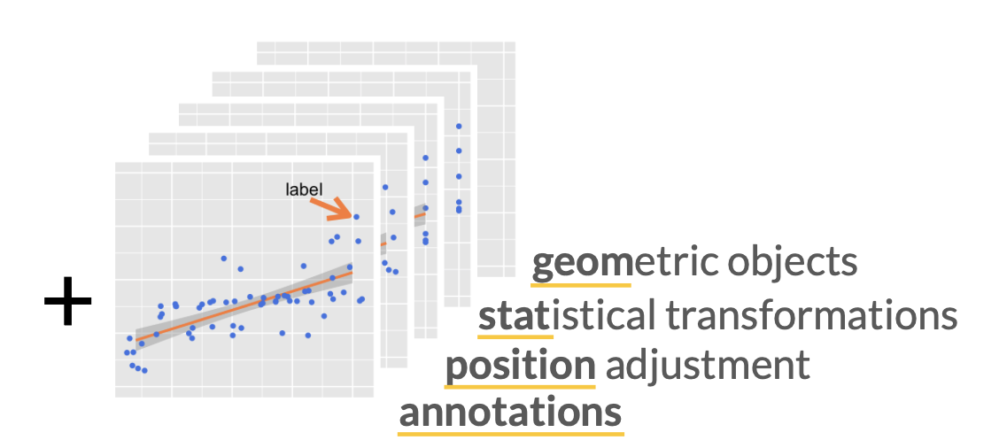
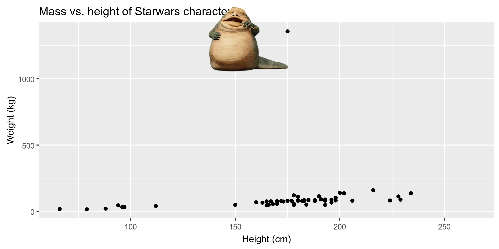

```{r child = "setup.Rmd"}
```

layout: true


<div class="my-footer">
<span>
 </img> Slides adapted from <a href="https://datasciencebox.org" target="_blank">datasciencebox.org</a> by Dr. Lucy D'Agostino McGowan
</span>
</div> 

---

## <i class="fas fa-laptop"></i> `Starwars`

- Go to the [sta-363-s20 GitHub organization](https://github.com/sta-363-s20) and search for `appex-02-starwars`
- Clone this repository into RStudio Cloud

---

```{r packages, echo=FALSE, message=FALSE, warning=FALSE}
library(emo)
library(tidyverse)
library(fontawesome)
library(magick)
```

class: center, middle

# Exploratory data analysis

---

## What is EDA?

- Exploratory data analysis (EDA) is an approach to analyzing data sets to summarize its main characteristics.
- Often, this is visual. That's what we're focusing on today.
- But we might also calculate summary statistics and perform data wrangling/manipulation/transformation at (or before) this stage of the 
analysis. That's what we'll focus on next.

---

class: center, middle

# Data visualization

---

## Data visualization

> *"The simple graph has brought more information to the data analyst’s mind than any other device." — John Tukey*

- Data visualization is the creation and study of the visual representation of data.
- There are many tools for visualizing data (R is one of them), and many approaches/systems within R for making data visualizations (**ggplot2** is one of them, and that's what we're going to use).

---

## ggplot2 $\in$ tidyverse

.pull-left[

]
.pull-right[
- **ggplot2** is tidyverse's data visualization package
- The `gg` in "ggplot2" stands for Grammar of Graphics
- It is inspired by the book **Grammar of Graphics** by Leland Wilkinson <sup>†</sup>
- A grammar of graphics is a tool that enables us to concisely describe the components of a graphic

]

.footnote[ 
<sup>†</sup> Source: [BloggoType](http://bloggotype.blogspot.com/2016/08/holiday-notes2-grammar-of-graphics.html)
]

---

.question[
Which function creates the plot? 
]

.small[
```{r fig.width = 6, fig.height=2.5}
ggplot(data = starwars, mapping = aes(x = height, y = mass)) +
  geom_point() +
  labs(title = "Mass vs. height of Starwars characters",
       x = "Height (cm)", y = "Weight (kg)")
```
]

---

.question[
What is the dataset being plotted? 
]

.small[
```{r fig.width = 6, fig.height=2.5}
ggplot(data = starwars, mapping = aes(x = height, y = mass)) +
  geom_point() +
  labs(title = "Mass vs. height of Starwars characters",
       x = "Height (cm)", y = "Weight (kg)")
```
]

---
.question[
Which variables are on the x-axis and y-axis? 
]

.small[
```{r fig.width = 6, fig.height=2.5}
ggplot(data = starwars, mapping = aes(x = height, y = mass)) +
  geom_point() +
  labs(title = "Mass vs. height of Starwars characters",
       x = "Height (cm)", y = "Weight (kg)")
```
]

---

.question[
What about that warning?
]

.small[
```{r fig.width = 6, fig.height=2.5}
ggplot(data = starwars, mapping = aes(x = height, y = mass)) +
  geom_point() +
  labs(title = "Mass vs. height of Starwars characters",
       x = "Height (cm)", y = "Weight (kg)")
```
]

---

.question[
What does `geom_smooth()` do? What else changed between the previous plot and this one?
]

.small[
```{r fig.width = 6, fig.height=2.5, warning=FALSE, message=FALSE}
ggplot(data = starwars, mapping = aes(x = height, y = mass)) +
  geom_point() +
  geom_smooth() + #<<
  labs(title = "Mass vs. height of Starwars characters",
       x = "Height (cm)", y = "Weight (kg)")
```
]

---

## Hello ggplot2!


.my-footer[
<font size="2">
Artwork by @allison_horst
</font>
]

---

## ggplot2 components

- **data**
- **aes**thetic mapping
- layer(s)

---

## ggplot2 premise



---

## Hello ggplot2!


---

## Hello ggplot2!



---

## Hello ggplot2!



---

## Hello ggplot2!



---

## Hello ggplot2!



---

## Hello ggplot2!

- `ggplot()` is the main function in ggplot2 and plots are constructed in layers
- The structure of the code for plots can often be summarized as
```{r eval = FALSE}
ggplot + 
  geom_xxx
```

--

or, more precisely

.small[
```{r eval = FALSE}
ggplot(data = [dataset], mapping = aes(x = [x-variable], y = [y-variable])) +
  geom_xxx() +
  other options
```
]

---

## Hello ggplot2!

- To use ggplot2 functions, first load tidyverse

```{r}
library(tidyverse)
```

--

- For help with the ggplot2, see [ggplot2.tidyverse.org](http://ggplot2.tidyverse.org/)

---

class: center, middle

# Visualizing Star Wars

---

## Dataset terminology

.question[
What does each row represent? What does each column represent?
]

```{r, eval = FALSE}
starwars
```

.small[
```{r echo = FALSE, message=FALSE}
starwars %>%
  head(5)
```
]

--

- Each row is an **observation**
- Each column is a **variable**

---

## Luke Skywalker


---

## What's in the Star Wars data?

Take a `glimpse` at the data:

```{r, message = FALSE}
glimpse(starwars)
```

---

## What's in the Star Wars data?

.question[
How many rows and columns does this dataset have? What does each row represent? What does each column represent?
]

Run the following **in the Console** to view the help
```{r eval = FALSE}
?starwars
```

```{r echo=FALSE}
knitr::include_graphics("img/02/starwars-help.png")
```

---

## Mass vs. height

.small[
```{r fig.width = 6, fig.height=3}
ggplot(data = starwars, mapping = aes(x = height, y = mass)) +
  geom_point()
```
]

---

## What's that warning?

- Not all characters have height and mass information (hence 28 of them not plotted)

.small[
```
## Warning: Removed 28 rows containing missing values (geom_point).
```
]

- Going forward I'll suppress the warning to save room on slides, but it's important to note it

---

## Mass vs. height

.question[
How would you describe this relationship? What other variables would help us understand data points that don't follow the overall trend? Who is the not so tall but really chubby character?
]

.small[
```{r fig.width = 6, fig.height=1.75, warning=FALSE}
ggplot(data = starwars, mapping = aes(x = height, y = mass)) +
  geom_point() +
  labs(title = "Mass vs. height of Starwars characters", #<<
       x = "Height (cm)", y = "Weight (kg)")             #<<
```
]

---

## Jabba!

```{r echo=FALSE, warning=FALSE, cache=TRUE}
jabba <- image_read("img/02/jabba.png")

fig <- image_graph(width = 2400, height = 1200, res = 300)
ggplot(data = starwars, mapping = aes(x = height, y = mass)) +
  geom_point(size = 1.5) + 
  labs(title = "Mass vs. height of Starwars characters",
       x = "Height (cm)", y = "Weight (kg)")
dev.off()

out <- fig %>% image_composite(jabba, offset = "+1000+30")

image_write(out, "img/02/jabbaplot.png", format = "png")

```

---

## Additional variables

We can map additional variables to various features of the plot:

- aesthetics
  - color
  - size
  - shape
  - alpha (transparency)
- faceting: small multiples displaying different subsets

---

class: center, middle

# Aesthetics

---

## Aesthetics options

Visual characteristics of plotting characters that can be **mapped to a specific variable**
in the data are

- `color`
- `size`
- `shape`
- `alpha` (transparency)

---

## Mass vs. height + gender

.small[
```{r fig.width = 7, fig.height=3.5, warning=FALSE}
ggplot(data = starwars, mapping = aes(x = height, y = mass, color = gender)) +
  geom_point()
```
]
---

## Mass vs. height + gender

Let's map the size to birth_year:

.small[
```{r fig.width = 7, fig.height=3, warning=FALSE}
ggplot(data = starwars,
       mapping = aes(x = height, y = mass, color = gender, 
                     size = birth_year #<<
       )) +
  geom_point()
```
]

---

## Mass vs. height + gender

Let's now increase the size of all points **not** based on the values of a 
variable in the data:

.small[
```{r fig.width = 7, fig.height=3.5, warning=FALSE}
ggplot(data = starwars, mapping = aes(x = height, y = mass, color = gender)) +
  geom_point(size = 2) #<<
```
]

---

## Aesthetics summary

- Continuous variable are measured on a continuous scale
- Discrete variables are measured (or often counted) on a discrete scale

aesthetics    | discrete                 | continuous
------------- | ------------------------ | ------------
color         | rainbow of colors        | gradient
size          | discrete steps           | linear mapping between radius and value
shape         | different shape for each | shouldn't (and doesn't) work

- Use aesthetics for mapping features of a plot to a variable, define the features in the geom for customization **not** mapped to a variable

---

class: center, middle

# Faceting

---

## Faceting options

- Smaller plots that display different subsets of the data
- Useful for exploring conditional relationships and large data

.small[
```{r fig.height=2, fig.width=6, warning=FALSE}
ggplot(data = starwars, mapping = aes(x = height, y = mass)) +
  facet_grid(. ~ gender) + #<<
  geom_point() +
  labs(title = "Mass vs. height of Starwars characters",
       subtitle = "Faceted by gender",  #<<
       x = "Height (cm)", y = "Weight (kg)")
```
]

---

## Dive further...

.question[
In the next few slides describe what each plot displays. Think about how the code relates to the output.
]

--

<br><br><br>

.alert[
The plots in the next few slides do not have proper titles, axis labels, etc. because we want you to figure out what's happening in the plots. But you should always label your plots!
]

---

.small[
```{r fig.height=4, fig.width=6, warning=FALSE}
ggplot(data = starwars, mapping = aes(x = height, y = mass)) +
  geom_point() +
  facet_grid(gender ~ .)
```
]

---

.small[
```{r fig.width=7, warning=FALSE}
ggplot(data = starwars, mapping = aes(x = height, y = mass)) +
  geom_point() +
  facet_grid(. ~ gender)
```
]

---

.small[
```{r fig.height=4.5, fig.width=7, warning=FALSE}
ggplot(data = starwars, mapping = aes(x = height, y = mass)) +
  geom_point() +
  facet_wrap(~ eye_color)
```
]

---

## Facet summary

- `facet_grid()`: 
- 2d grid
- `rows ~ cols`
- use `.` for no split
- `facet_wrap()`: 1d ribbon wrapped into 2d

---

class: center, middle

## More ggplot2 info:

## ggplot2 in 2

### [https://leanpub.com/ggplot2in2/c/sta-212-f19](https://leanpub.com/ggplot2in2/c/sta-212-f19)

---

## <i class="fas fa-laptop"></i> `Starwars`

- Go to the [sta-363-s20 GitHub organization](https://github.com/sta-363-s20) and search for `appex-02-starwars`
- Clone this repository into RStudio Cloud
- Complete the exercises
- **Commit** your changes
- **Push** them back to GitHub
---

class: center, middle

# Identifying variables

---

## Types of variables

- **Numerical variables** (quantitative variables) can be classified as **continuous** or **discrete** based on whether or not the variable can take on an infinite number of values or only non-negative whole numbers, respectively. 
- If the variable is **categorical**, we can determine if it is **ordinal** based on whether or not the levels have a natural ordering.

---

class: center, middle

# Visualizing numerical data

---

## Describing shapes of numerical distributions

* shape:
  * skewness: right-skewed, left-skewed, symmetric (skew is to the side of the longer tail)
  * modality: unimodal, bimodal, multimodal, uniform
* center: mean (`mean`), median (`median`), mode (not always useful)
* spread: range (`range`), standard deviation (`sd`), inter-quartile range (`IQR`)
* unusual observations

---

## Histograms

.small[
```{r fig.width = 7, fig.height = 4, message = FALSE, warning = FALSE}
ggplot(data = starwars, mapping = aes(x = height)) +
  geom_histogram(binwidth = 10)
```
]

---

## Density plots

.small[
```{r fig.width = 7, fig.height = 4, message = FALSE, warning = FALSE}
ggplot(data = starwars, mapping = aes(x = height)) +
  geom_density()
```
]

---

## Side-by-side box plots

.small[
```{r fig.width = 7, fig.height = 4, message = FALSE, warning = FALSE}
ggplot(data = starwars, mapping = aes(y = height, x = gender)) +
  geom_boxplot()
```
]

---

## Side-by-side box plots

.small[
```{r fig.width = 7, fig.height = 4, message = FALSE, warning = FALSE}
ggplot(data = starwars, mapping = aes(y = height, x = gender)) +
  geom_boxplot(outlier.shape = NA) + 
  geom_jitter()
```
]

---

class: center, middle

## Show your data!

---

class: center, middle

# Visualizing categorical data

---

## Bar plots

.small[
```{r fig.width = 7, fig.height = 4}
ggplot(data = starwars, mapping = aes(x = gender)) +
  geom_bar()
```
]

---

## Segmented bar plots, counts

.small[
```{r fig.width = 7, fig.height = 4}
ggplot(data = starwars,
       mapping = aes(x = gender, fill = hair_color)) +
  geom_bar()
```
]

---

## Segmented bar plots, proportions

.small[
```{r fig.width = 7, fig.height = 4}
ggplot(data = starwars, 
       mapping = aes(x = gender, fill = hair_color)) +
  geom_bar(position = "fill") +
  labs(y = "proportion")
```
]

---

## Which plot is more appropriate?

.question[
Which plot is a more useful representation for visualizing the relationship between gender and height?
]


```{r echo=FALSE, fig.height=1.5, fig.width=6, message = FALSE, warning = FALSE}
starwars %>%
  group_by(gender) %>%
  summarise(average_height = mean(height, na.rm = TRUE)) %>%
ggplot(mapping = aes(x = gender, y = average_height)) +
  geom_col()
ggplot(data = starwars, mapping = aes(x = gender, y = height)) +
  geom_boxplot(outlier.shape = NA) + 
  geom_jitter(alpha = 0.6)
```