```{r child = "setup.Rmd"}
```

layout: true

<div class="my-footer">
<span>
Dr. Lucy D'Agostino McGowan <i>adapted from slides by Hastie & Tibshirani</i>
</span>
</div> 

```{r, echo = FALSE, message = FALSE, warning = FALSE}
knitr::opts_chunk$set(echo = FALSE, message = FALSE, warning = FALSE)
library(tidyverse)
```

---

## Study Sessions

* Monday 7-9p
* Manchester 122

---

## Lab 01


* Knit, Commit, Push **often**
* Commit and Push **all files**
* Check on GitHub.com to make sure everything is updating
* You won't see a _rendered_ file

---

## Regression and Classification

* Regression: quantitative response
* Classification: qualitative (categorical) response

---

## Regression and Classification

.question[
What would be an example of a **regression** problem?
]

* Regression: quantitative response
* Classification: qualitative (categorical) response

---


## Regression and Classification

.question[
What would be an example of a **classification** problem?
]

* Regression: quantitative response
* Classification: qualitative (categorical) response

---

class: center, middle

# Regression

---

## Auto data


```{r, fig.height = 2}
library(ISLR)
library(gridExtra)
p1 <- ggplot(Auto, aes(horsepower, mpg)) +
  geom_point(size = 1) + geom_smooth(method = "lm") +
  theme_classic()
p2 <- ggplot(Auto, aes(weight, mpg)) + 
  geom_point(size = 1) + 
  geom_smooth(method = "lm") + 
  theme_classic()
p3 <- ggplot(Auto, aes(acceleration, mpg)) +
  geom_point(size = 1) + 
  geom_smooth(method = "lm") + 
  theme_classic()
grid.arrange(p1, p2, p3, nrow = 1)
```

Above are `mpg` vs `horsepower`, `weight`, and `acceleration`, with a blue linear-regression line fit separately to each. Can we predict `mpg` using these three?

--

Maybe we can do better using a model:

$\texttt{mpg} \approx f(\texttt{horsepower}, \texttt{weight}, \texttt{acceleration})$

---

## Notation

* `mpg` is the **response** variable, the **outcome** variable, we refer to this as $Y$
* `horsepower` is a **feature**, **input**, **predictor**, we refer to this as $X_1$
* `weight` is $X_2$
* `acceleration` is $X_3$
--
* Our **input vector** is

$$X = \begin{bmatrix} X_1 \\X_2 \\X_3\end{bmatrix}$$

--
* Our **model** is

$$Y = f(X) + \epsilon$$
* $\epsilon$ is our error

---

## Why do we care about $f(X)$?

* We can use $f(X)$ to make predictions of $Y$ for new values of $X = x$
--
* We can gain a better understanding of which components of $X = (X_1, X_2, \dots, X_p)$ are important for explaining $Y$
--
* Depending on how complex $f$ is, maybe we can understand how each component ( $X_j$ ) of $X$ affects $Y$

---

```{r, fig.height = 2}
ggplot(Auto, aes(horsepower, mpg)) +
  geom_point(size = 3, color = "grey") + 
  geom_smooth(method = "loess", se = FALSE) + 
  geom_vline(xintercept = 100, color = "blue") +
  geom_point(aes(x = 100, y = 21.6), size = 3, color = "blue") +
  theme_classic()
```
How do we choose $f(X)$? What is a good value for
$f(X)$ at any selected value of $X$, say $X = 100$? There can be many $Y$ values at $X = 100$. 
--

A good value is

$$f(100) = E(Y|X = 100)$$

--

$E(Y|X = 100)$ means **expected value** (average) of $Y$ given $X = 100$

--

This ideal $f(x) = E(Y | X = x)$ is called the **regression function**

---

## Regression function, $f(X)$

* Also works or a vector, $X$, for example,

$$f(x) = f(x_1, x_2, x_3) = E[Y | X_1 = x_1, X_2 = x_2, X_3 = x_3]$$

* This is the **optimal** predictor of $Y$ in terms of **mean-squared prediction error**
--

.definition[
$f(x) = E(Y|X = x)$ is the function that **minimizes** $E[(Y - g(X))^2 |X = x]$ over all
functions $g$ at all points $X = x$
]

--
* $\epsilon = Y - f(x)$ is the **irreducible error** 
* even if we knew $f(x)$, we would still make errors in prediction, since at each $X = x$ there is typically a distribution of possible $Y$ values

---

```{r, fig.height = 3}
ggplot(Auto, aes(horsepower, mpg)) +
  geom_point(color = "grey") + 
  geom_smooth(method = "loess", se = FALSE) + 
  geom_vline(xintercept = 100, color = "blue") +
  geom_point(aes(x = 100, y = 21.6), size = 3, color = "blue") +
  theme_classic()
```

---

```{r, fig.height = 3}
ggplot(Auto, aes(horsepower, mpg)) +
  geom_point(color = "grey") + 
  geom_smooth(method = "loess", se = FALSE) + 
  geom_point(data = Auto %>% filter(horsepower == 100), aes(horsepower, mpg), color = "blue") +
  theme_classic()
```

```{r, eval = FALSE}
Auto %>%
  filter(horsepower == 100) %>%
  summarise(mean(mpg))
```

.question[
Using these points, how would I calculate the **regression function**?
]

--
* Take the average! $f(100) = E[\texttt{mpg}|\texttt{horsepower} = 100] = 19.6$

---

```{r, fig.height = 3}
ggplot(Auto, aes(horsepower, mpg)) +
  geom_point(color = "grey") + 
  geom_point(aes(x = 100, y = 32.9), size = 4, color = "red") + 
  geom_smooth(method = "loess", se = FALSE) + 
  geom_point(data = Auto %>% filter(horsepower == 100), aes(horsepower, mpg), color = "blue") +
  theme_classic()
```

.question[
This point has a $Y$ value of 32.9. What is $\epsilon$?
]

--

* $\epsilon = Y - f(X) = 32.9 - 19.6 = \color{red}{13.3}$

---

## The error

For any estimate, $\hat{f}(x)$, of $f(x)$, we have

$$E[(Y - \hat{f}(x))^2 | X = x] = \underbrace{[f(x) - \hat{f}(x)]^2}_{\textrm{reducible error}} + \underbrace{Var(\epsilon)}_{\textrm{irreducible error}}$$

???

* Assume for a moment that both $\hat{f}$ and X are fixed.
* $E(Y − \hat{Y})^2$ represents the average, or expected value, of the squared difference between the predicted and actual value of Y, and Var( $\epsilon$ ) represents the variance associated with the error term
* The focus of this class is on techniques for estimating f with the aim of minimizing the reducible error. 
* the irreducible error will always provide an upper bound on the accuracy of our prediction for Y
* This bound is almost always unknown in practice
---

## Estimating $f$

* Typically we have very few (if any!) data points at $X=x$ exactly, so we cannot compute $E[Y|X=x]$
--
* For example, what if we were interested in estimating miles per gallon when horsepower was 104.

```{r, fig.height = 1.25}
ggplot(Auto, aes(horsepower, mpg)) +
  geom_point(color = "grey") + 
  geom_smooth(method = "loess", se = FALSE) + 
  geom_vline(xintercept = 104, color = "blue") +
  geom_point(aes(x = 104, y = 20.8), color = "blue") +
  theme_classic()
```
--

`r emo::ji("bulb")` We can _relax_ the definition and let

$$\hat{f}(x) = E[Y | X\in \mathcal{N}(x)]$$

---

## Estimating $f$

* Typically we have very few (if any!) data points at $X=x$ exactly, so we cannot compute $E[Y|X=x]$
* For example, what if we were interested in estimating miles per gallon when horsepower was 104.

```{r, fig.height = 1.25}
ggplot(Auto, aes(horsepower, mpg)) +
  geom_point(color = "grey") + 
  geom_smooth(method = "loess", se = FALSE) + 
  geom_vline(xintercept = c(100, 108), color = "blue", lty = 2) +
  geom_vline(xintercept = 104, color = "blue") +
  geom_point(aes(x = 104, y = 20.8), color = "blue") +
  theme_classic()
```

`r emo::ji("bulb")` We can _relax_ the definition and let

$$\hat{f}(x) = E[Y | X\in \mathcal{N}(x)]$$

* Where $\mathcal{N}(x)$ is some **neighborhood** of $x$

---

## Notation pause!

<br><br><br>

$$\hat{f}(x) = \underbrace{E}_{\textrm{The expectation}}[\underbrace{Y}_{\textrm{of Y}} \underbrace{|}_{\textrm{given}} \underbrace{X\in \mathcal{N}(x)}_{\textrm{X is in the neighborhood of x}}]$$
--

.alert[
If you need a notation pause at any point during this class, please let me know! 
]

---

## Estimating $f$

`r emo::ji("bulb")` We can _relax_ the definition and let

$$\hat{f}(x) = E[Y | X\in \mathcal{N}(x)]$$

--
* Nearest neighbor averaging does pretty well with small $p$ ( $p\leq 4$ ) and large $n$
--
* Nearest neighbor is _not great_ when $p$ is large because of the **curse of dimensionality** (because nearest neighbors tend to be far away in high dimensions)

--
.question[
What do I mean by $p$? What do I mean by $n$?
]

---

## Parametric models

A common parametric model is a **linear** model

$$f(X) = \beta_0 + \beta_1X_1 + \beta_2X_2 + \dots + \beta_pX_p$$

--
* A linear model has $p + 1$ parameters ( $\beta_0,\dots,\beta_p$ )
--
* We estimate these parameters by **fitting** a model to **training** data
--
* Although this model is _almost never correct_ it can often be a good interpretable approximation to the unknown true function, $f(X)$

---

class: center, middle

## Let's look at a simulated example

---

<center>
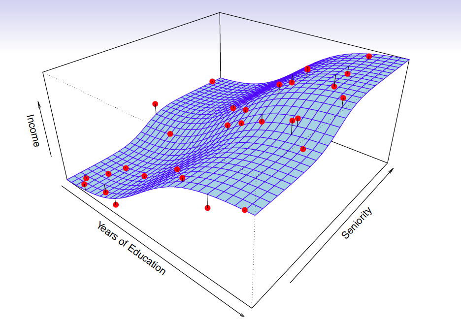 </img>
</center>

* The <font color = "red"> red </font> points are simulated values for `income` from the model:

$$\texttt{income} = f(\texttt{education, senority}) + \epsilon$$
* $f$ is the <font color = "blue"> blue </font> surface

---

<center>
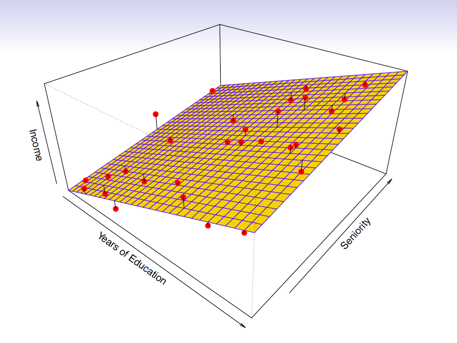 </img>
</center>

Linear regression model fit to the simulated data

$$\hat{f}_L(\texttt{education, senority}) = \hat{\beta}_0 + \hat{\beta}_1\texttt{education}+\hat{\beta}_2\texttt{senority}$$

---

<center>
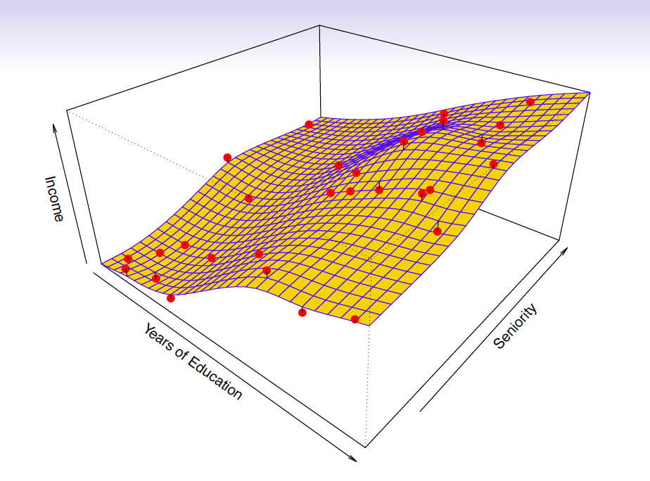 </img>
</center>

* More flexible regression model $\hat{f}_S(\texttt{education, seniority})$ fit to the simulated data
* Here we use a technique called a **thin-plate spline** to fit a flexible surface

---

<center>
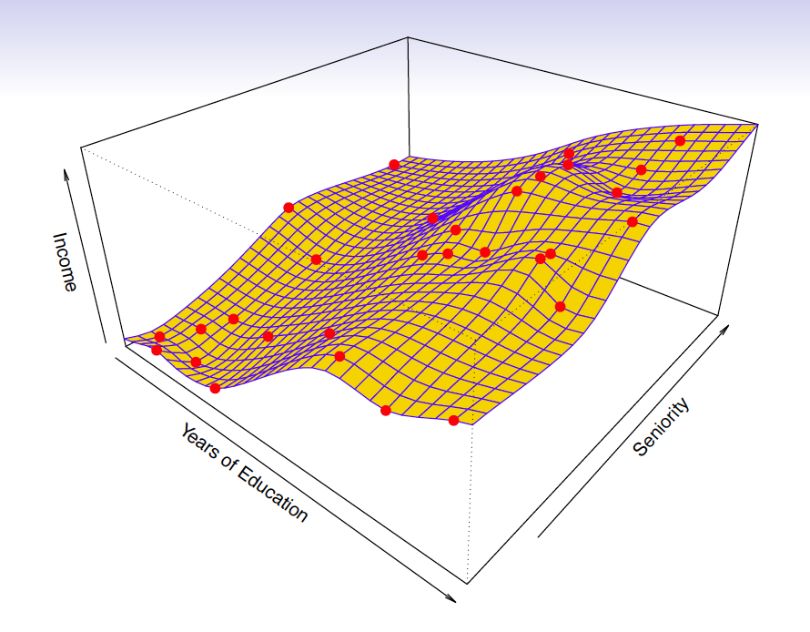 </img>
</center>

And even **MORE flexible** `r emo::ji("scream")` model $\hat{f}(\texttt{education, seniority})$
* Here we've basically drawn the surface to hit every point, minimizing the error, but completely **overfitting**

---

## `r emo::ji("person_juggling")` Finding balance

* **Prediction accuracy** versus **interpretability**
* Linear models are easy to interpret, thin-plate splines
are not
--
* Good fit versus **overfit** or **underfit**
* How do we know when the fit is just right?
--
* **Parsimony** versus **black-box**
* We often prefer a simpler model involving fewer variables over a black-box predictor involving them all

---


---

## Accuracy

* We've fit a model $\hat{f}(x)$ to some training data $\texttt{train} = \{x_i, y_i\}^N_1$
* We can measure **accuracy** as the average squared prediction error over that `train` data

$$MSE_{\texttt{train}} = \textrm{Ave}_{i\in\texttt{train}}[y_i-\hat{f}(x_i)]^2$$
--

.question[
What can go wrong here? 
]

--
* This may be biased towards **overfit** models

---

## Accuracy


```{r, echo = FALSE, fig.height = 2}
df <- tibble(
  x = sample(1:100, 20),
  y = ifelse(x < 20, .1 * x ^ 2, 200 + - 2 * x) + rnorm(20, sd = 20)
)
ggplot(df, aes(x, y)) + 
  geom_point()
```

.question[
I have some `train` data, plotted above. What $\hat{f}(x)$ would minimize the $MSE_{\texttt{train}}$?
]

$$MSE_{\texttt{train}} = \textrm{Ave}_{i\in\texttt{train}}[y_i-\hat{f}(x_i)]^2$$

---

## Accuracy 

```{r, echo = FALSE, fig.height = 2}
ggplot(df, aes(x, y)) + 
  geom_point() +
  geom_line()
```

.question[
I have some `train` data, plotted above. What $\hat{f}(x)$ would minimize the $MSE_{\texttt{train}}$?
]

$$MSE_{\texttt{train}} = \textrm{Ave}_{i\in\texttt{train}}[y_i-\hat{f}(x_i)]^2$$

---

## Accuracy 

```{r, echo = FALSE, fig.height = 2}
ggplot(df, aes(x, y)) + 
  geom_point() +
  geom_line()
```

.question[
What is wrong with this?
]

--

It's **overfit!**

---

## Accuracy

```{r, echo = FALSE, fig.height = 2}
df2 <- tibble(
  x = sample(1:100, 20),
  y = ifelse(x < 20, .1 * x ^ 2, 200 + - 2 * x) + rnorm(20, sd = 20)
)
ggplot(df2, aes(x, y)) + 
  geom_point() + 
  geom_line(data = df, aes(x, y))
```

If we get a new sample, that overfit model is probably going to be terrible!

---

## Accuracy

* We've fit a model $\hat{f}(x)$ to some training data $\texttt{train} = \{x_i, y_i\}^N_1$
* Instead of measuring **accuracy** as the average squared prediction error over that `train` data, we can compute it using fresh `test` data $\texttt{test} = \{x_i,y_i\}^M_1

$$MSE_{\texttt{test}} = \textrm{Ave}_{i\in\texttt{test}}[y_i-\hat{f}(x_i)]^2$$

---

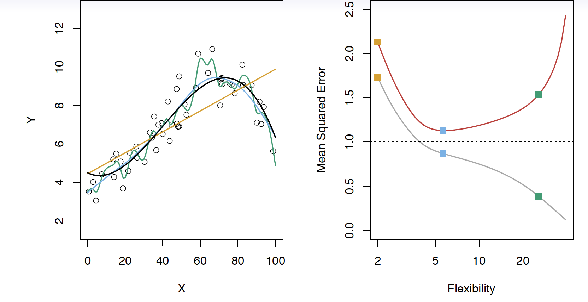

Black curve is the "truth" on the left. <font color="red"> Red </font> curve on right is $MSE_{\texttt{test}}$, <font color="grey">grey </font>curve is $MSE_{\texttt{train}}$. <font color="orange">Orange</font>, <font color="blue">blue </font>and <font color="green">green </font>curves/squares correspond to fis of different flexibility.
---

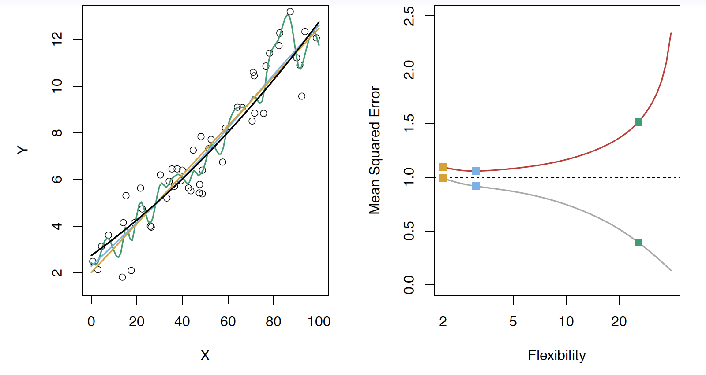

Here the truth is smoother, so the smoother fit and linear model do
really well
---

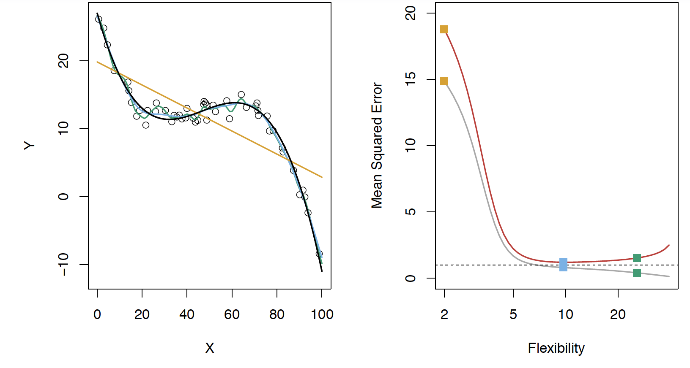

Here the truth is wiggly and the noise is low, so the more flexible fits do the best
---

## Bias-variance trade-off

* We've fit a model, $\hat{f}(x)$, to some training data
--
* Let's pull a test observation from this population ( $x_0, y_0$ )
--
* The _true_ model is $Y = f(x) + \epsilon$
--
* $f(x) = E[Y|X=x]$

$$E(y_0 - \hat{f}(x_0))^2 = \textrm{Var}(\hat{f}(x_0)) + [\textrm{Bias}(\hat{f}(x_0))]^2 + \textrm{Var}(\epsilon)$$

--

The expectation averages over the variability of $y_0$ as well as the variability of the training data. $\textrm{Bias}(\hat{f}(x_0)) =E[\hat{f}(x_0)]-f(x_0)$

* As **flexibility** of $\hat{f}$ $\uparrow$, its variance $\uparrow$ and its bias $\downarrow$
--
* choosing the flexibility based on average test error amounts to a **bias-variance trade-off**

???

* That U-shape we see for the test MSE curves is due to this bias-variance trade-off
* The expected test MSE for a given $x_0$ can be decomposed into three components: the **variance** of $\hat{f}(x_o)$, the squared **bias** of $\hat{f}(x_o)$ and t4he variance of the error term $\epsilon$
* Here the notation $E[y_0 − \hat{f}(x_0)]^2$ defines the expected test MSE, and refers to the average test MSE that we would obtain if we repeatedly estimated $f$ using a large number of training sets, and tested each at $x_0$
* The overall expected test MSE can be computed by averaging  $E[y_0 − \hat{f}(x_0)]^2$ over all possible values of $x_0$ in the test set.
* SO we want to minimize the expected test error, so to do that we need to pick a statistical learning method to simultenously acheive low bias and low variance. 
* Since both of these quantities are non-negative, the expected test MSE can never fall below Var( $\epsilon$ )
---

## Bias-variance trade-off

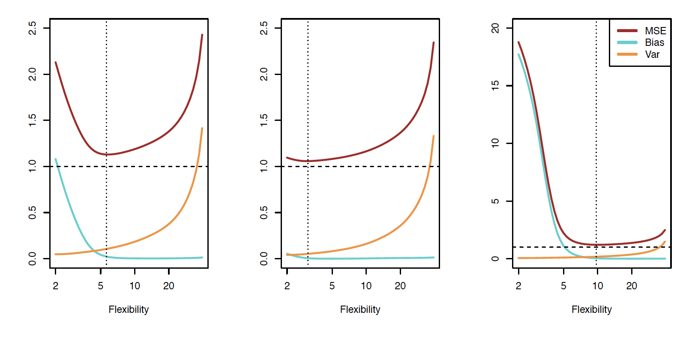

---

class: center, middle

# Classification

---

## Notation

* $Y$ is the response variable. It is **qualitative**
* $\mathcal{C}(X)$ is the classifier that assigns a class $\mathcal{C}$ to some future unlabeled observation, $X$
--
* Examples:
  * Email can be classified as $\mathcal{C}=(\texttt{spam, not spam})$
  * Written number is one of $\mathcal{C}=\{0, 1, 2, \dots, 9\}$

---

## Classification Problem

.question[
What is the goal?
]

--

* Build a classifier $\mathcal{C}(X)$ that assigns a class label from $\mathcal{C}$ to a future unlabeled observation $X$
* Assess the uncertainty in each classification
* Understand the roles of the different predictors among $X = (X_1, X_2, \dots, X_p)$

---

<center>
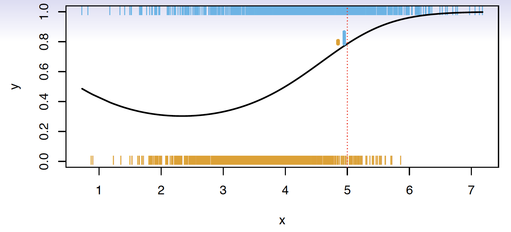</img>
</center>

Suppose there are $K$ elements in $\mathcal{C}$, numbered $1, 2, \dots, K$

$$p_k(x) = P(Y = k|X=x), k = 1, 2, \dots, K$$
These are **conditional class probabilities** at $x$

--
.question[
How do you think we could calculate this?
]

--
* In the plot, you could examine the mini-barplot at $x = 5$
---

<center>
</img>
</center>

Suppose there are $K$ elements in $\mathcal{C}$, numbered $1, 2, \dots, K$

$$p_k(x) = P(Y = k|X=x), k = 1, 2, \dots, K$$
These are **conditional class probabilities** at $x$

* The **Bayes optimal classifier** at $x$ is

$$\mathcal{C}(x) = j \textrm{ if } p_j(x) = \textrm{max}\{p_1(x), p_2(x), \dots, p_K(x)\}$$

???

* Notice that probability is a **conditional** probability 
* It is the probability that Y equals k given the observed preditor vector, $x$ 
* Let's say we were using a Bayes Classifier for a two class problem, Y is 1 or 2. We would predict that the class is one if $P(Y=1|X=x_0)>0.5$ and 2 otherwise

---

<center>
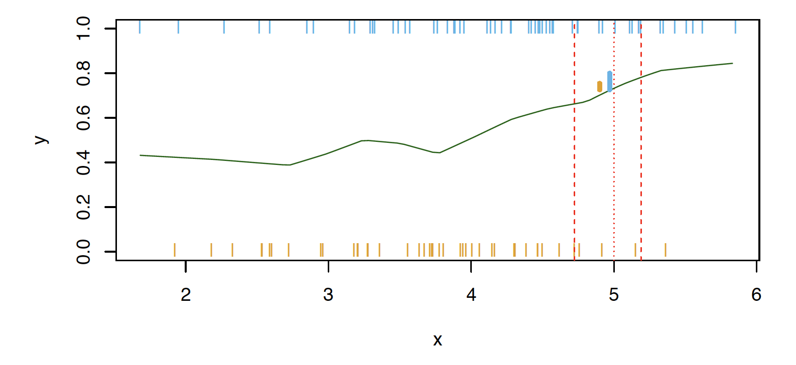</img>
</center>

.question[
What if this was our data and there were no points at exactly $x = 5$? Then how could we calculate this?
]

--
* Nearest neighbor like before!
--
* This does break down as the dimensions grow, but the impact of $\mathcal{\hat{C}}(x)$ is less than on $\hat{p}_k(x), k = 1,2,\dots,K$

---

## Accuracy

* Misclassification error rate

$$Err_{\texttt{test}} = \textrm{Ave}_{i\in\texttt{test}}I[y_i\neq \mathcal{\hat{C}}(x_i)]$$

--
* The **Bayes Classifier** using the true $p_k(x)$ has the smallest error
--
* Some of the methods we will learn build structured models for $\mathcal{C}(x)$ (support vector machines, for example)
--
* Some build structured models for $p_k(x)$ (logistic regression, for example)

???

* the test error rate $\textrm{Ave}_{i\in\texttt{test}}I[y_i\neq \mathcal{\hat{C}}(x_i)]$ is minimized on average by very simple classifier that assigns each observation to the most likely class, given its predictor values (that's the Bayes classifier)

---

## K-Nearest-Neighbors example

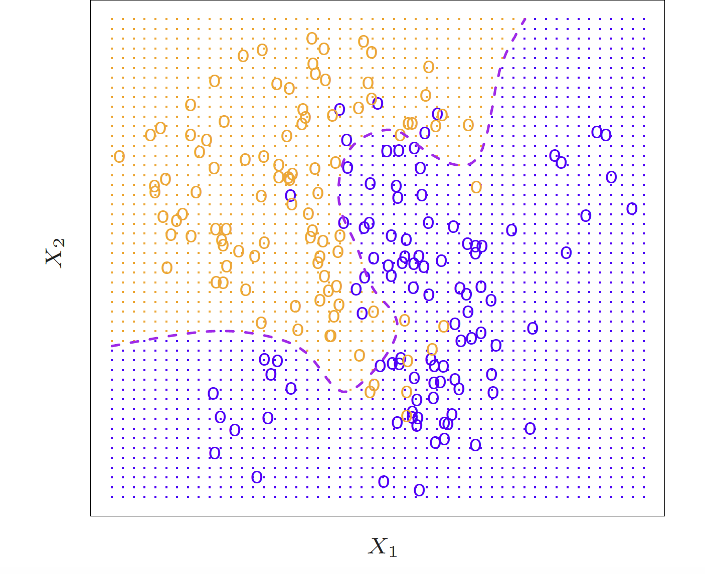</img>

???

* Here is a simulated dataset of 100 observations in two groups, blue and orange
* The purple dashed line represents the Bayes decision boundary
* The orange background grid indicates the region where the test observations will be classified as orange, and the blue for the blue
* We'd love to be able to use the Bayes classifier to but for real data, we don't know the conditional distribution of Y given X so computing the Bayes classifier is impossible
* Alot of methods try to estimate the conditional distribution of Y given X and then classify a given observation to the class with the highest **estimated** probability
* One method to do this is K-nearest neighbors

---

## KNN (K = 10)

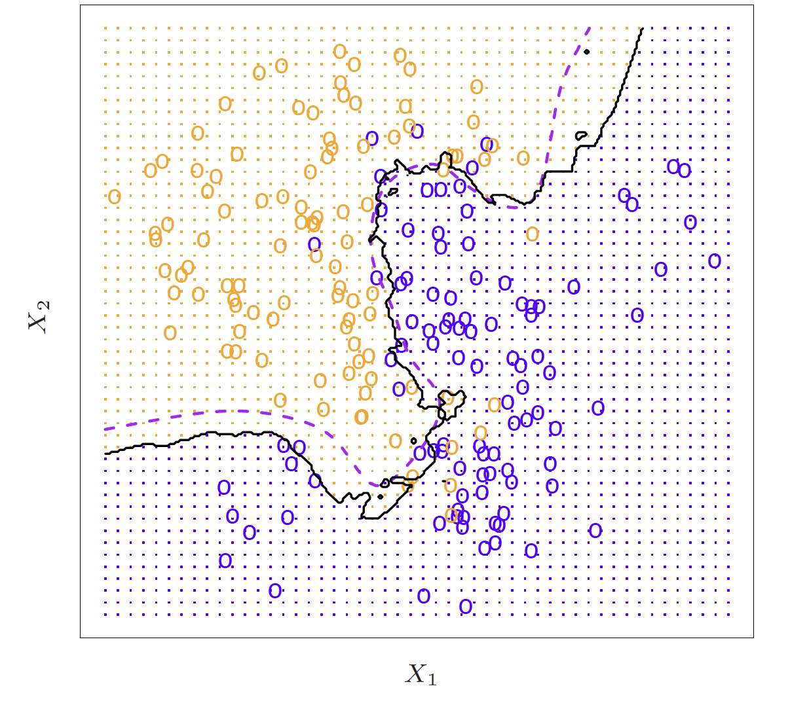</img>

???

* Again, the way KNN works is if K = 10, it is finding the 10 closest observations and calculating the probability of being orange or blue and will classify that point as such
* So here is an example of K nearest neighbors where K is 10

---

## KNN


???

* Because this dataset has 100 data points, K can range from 1 to 100 where at 1, the error rate in the TRAINING data will be 0 but the test error rate may be really high. So we are trying to find the happy medium. The test error is going to have that same u-shape relationship, you want to find the bottom of that U

---

## Trade-offs

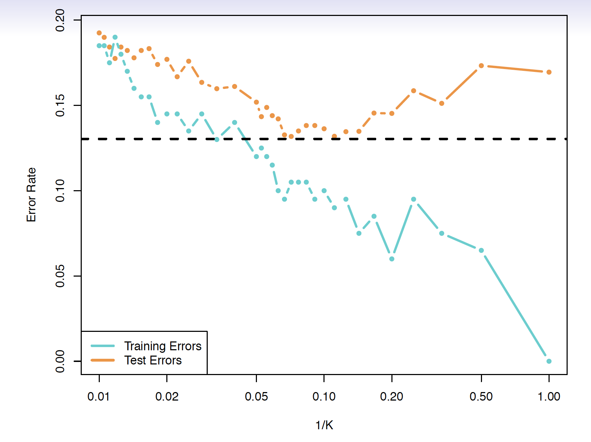

