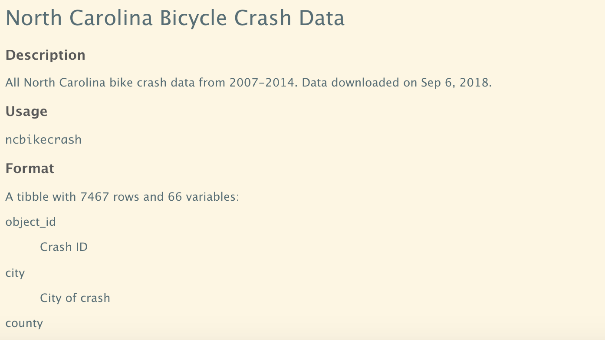

```{r child = "setup.Rmd"}
```
layout: true

<div class="my-footer">
<span>
 </img> Slides adapted from <a href="https://datasciencebox.org" target="_blank">datasciencebox.org</a> by Dr. Lucy D'Agostino McGowan
</span>
</div> 

---

```{r packages, echo=FALSE, message=FALSE, warning=FALSE}
library(tidyverse)
library(emo)
library(dsbox)
```

## <i class="fas fa-laptop"></i> `NC bike crashes`

- Go to the [sta-363-s20 GitHub organization](https://github.com/sta-363-s20) and search for `appex-02-nc-bike-crashes`
- Clone this repository into RStudio Cloud

---

class: center, middle

# Tidy data


---

## Tidy data

>Happy families are all alike; every unhappy family is unhappy in its own way. 
>
>Leo Tolstoy

--

.pull-left[
**Characteristics of tidy data:**

- Each variable forms a column.
- Each observation forms a row.
- Each type of observational unit forms a table.
]
--
.pull-right[
**Characteristics of untidy data:**

!@#$%^&*()
]

---


class: center, middle

# Pipes

---

## Where does the name come from?

The pipe operator is implemented in the package **magrittr**, it's pronounced 
"and then".

.pull-left[

]
.pull-right[

]

---

## Review: How does a pipe work?

- You can think about the following sequence of actions - find key, 
unlock car, start car, drive to school, park.
- Expressed as a set of nested functions in R pseudocode this would look like:
```{r eval=FALSE}
park(drive(start_car(find("keys")), to = "campus"))
```
- Writing it out using pipes give it a more natural (and easier to read) 
structure:
```{r eval=FALSE}
find("keys") %>%
  start_car() %>%
  drive(to = "campus") %>%
  park()
```

---

## What about other arguments?

To send results to a function argument other than first one or to use the previous result for multiple arguments, use `.`:

```{r fig.height=1.8, fig.width = 3.75}
starwars %>%
  filter(species == "Human") %>%
  lm(mass ~ height, data = .)
```

---

# Data wrangling


.my-footer[
<font size="2">
Artwork by @allison_horst
</font>
]
---

## Bike crashes in NC 2007 - 2014

The dataset is in the **dsbox** package:

```{r load-data, eval=FALSE}
library(dsbox)
ncbikecrash
```

---

## Variables

View the names of variables via
.small[
```{r}
names(ncbikecrash)
```
]

---

## Variables

See detailed descriptions with `?ncbikecrash`.



---

## Viewing your data

- In the Environment, after loading with `data(ncbikecrash)`, click on the name of the data frame to view it in the data viewer
- Use the `glimpse` function to take a peek

```{r}
glimpse(ncbikecrash)
```

---

## A Grammar of Data Manipulation

**dplyr** is based on the concepts of functions as verbs that manipulate data frames.

.pull-left[

]
.pull-right[
.midi[
- `filter`: pick rows matching criteria
- `slice`: pick rows using index(es)
- `select`: pick columns by name
- `pull`: grab a column as a vector
- `arrange`: reorder rows
- `mutate`: add new variables
- `distinct`: filter for unique rows
- `sample_n` / `sample_frac`: randomly sample rows
- `summarise`: reduce variables to values
- ... (many more)
]
]

---

## **dplyr** rules for functions

- First argument is *always* a data frame
- Subsequent arguments say what to do with that data frame
- Always return a data frame
- Doesn't modify in place

---

## A note on piping and layering

- The `%>%` operator in **dplyr** functions is called the pipe operator. This means you "pipe" the output of the previous line of code as the first input of the next line of code.

--
- The `+` operator in **ggplot2** functions is used for "layering". This means you create the plot in layers, separated by `+`.

---

## `filter` to select a subset of rows

for crashes in Durham County

.small[
```{r}
ncbikecrash %>%
  filter(county == "Durham") #<<
```
]

---

## `filter` for many conditions at once

for crashes in Durham County where biker was 0-5 years old

.small[
```{r}
ncbikecrash %>%
  filter(county == "Durham", bike_age_group == "0-5")
```
]

---

## Logical operators in R

operator    | definition                   || operator     | definition
------------|------------------------------||--------------|----------------
`<`         | less than                    ||`x`&nbsp;&#124;&nbsp;`y`     | `x` OR `y` 
`<=`        |	less than or equal to        ||`is.na(x)`    | test if `x` is `NA`
`>`         | greater than                 ||`!is.na(x)`   | test if `x` is not `NA`
`>=`        |	greater than or equal to     ||`x %in% y`    | test if `x` is in `y`
`==`        |	exactly equal to             ||`!(x %in% y)` | test if `x` is not in `y`
`!=`        |	not equal to                 ||`!x`          | not `x`
`x & y`     | `x` AND `y`                  ||              |

---

## `select` to keep variables

.small[
```{r}
ncbikecrash %>%
  filter(county == "Durham", bike_age_group == "0-5") %>%
  select(locality, speed_limit)
```
]

---

## `select` to exclude variables

.small[
```{r}
ncbikecrash %>%
  select(-object_id)
```
]

---

## `select` a range of variables

.small[
```{r}
ncbikecrash %>%
  select(city:locality)
```
]

---

## `summarize` to reduce variables to values

.small[
```{r}
ncbikecrash %>%
  summarize(avg_hr = mean(crash_hour))
```
]

---

## `group_by` to do calculations on groups

.small[
```{r}
ncbikecrash %>%
  group_by(hit_run) %>%
  summarise(avg_hr = mean(crash_hour))
```
]

---

## `mutate` to add new variables

.small[
```{r eval=FALSE}
ncbikecrash %>%
  mutate(weather_clear = case_when(
    weather == "Clear"       ~ "Yes",
    TRUE ~ "No"
  ))
```
]

 </img>

.my-footer[
<font size="2">
Artwork by @allison_horst
</font>
]
---

## "Save" when you `mutate`

Most often when you define a new variable with `mutate` you'll also want to save the resulting data frame, often by writing over the original data frame.

.small[
```{r}
ncbikecrash <- ncbikecrash %>% #<<
  mutate(weather_clear = case_when(
    weather == "Clear"       ~ "Yes",
    TRUE ~ "No"
  ))
```
]

---

## "Save" when you `mutate`

Most often when you define a new variable with `mutate` you'll also want to save the resulting data frame, often by writing over the original data frame.

.small[
```{r}
ncbikecrash %>%
  mutate(weather_clear = case_when(
    weather == "Clear"       ~ "Yes",
    TRUE ~ "No"
  )) -> ncbikecrash #<<
```
]

---

## Check before you move on

.small[
```{r}
ncbikecrash %>% 
  count(weather_clear, weather)
```
]

---

## <i class="fas fa-laptop"></i> `NC bike crashes`

- Go to the [sta-363-s20 GitHub organization](https://github.com/sta-363-s20) and search for `appex-02-nc-bike-crashes`
- Clone this repository into RStudio Cloud
- Complete the exercises
- **Commit** your changes
- **Push** them back to GitHub

