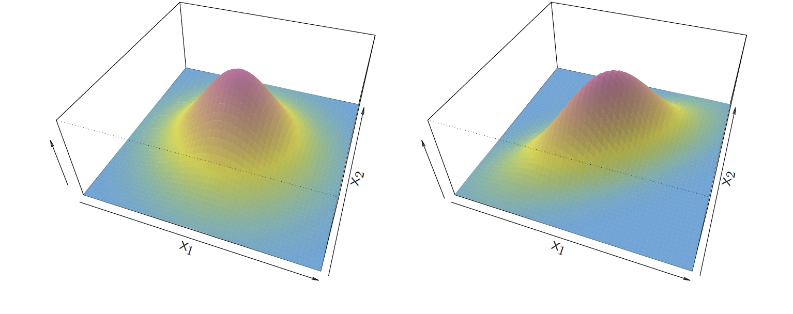
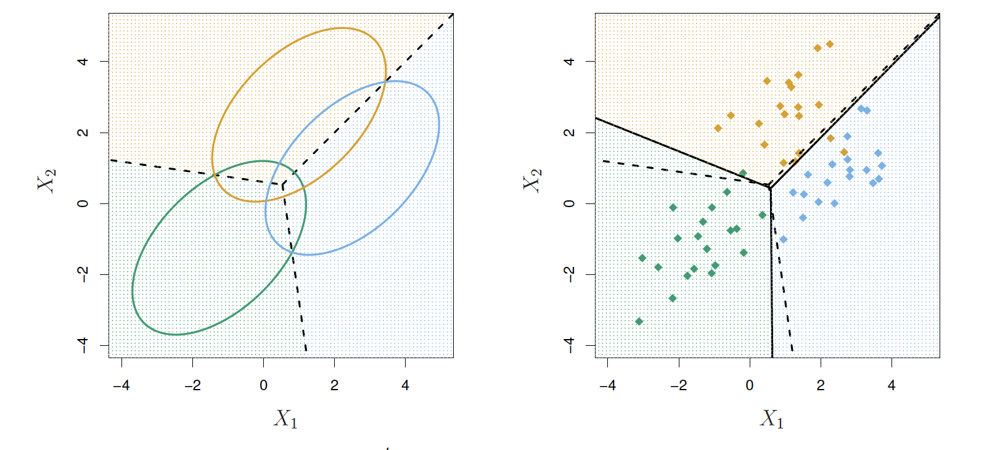
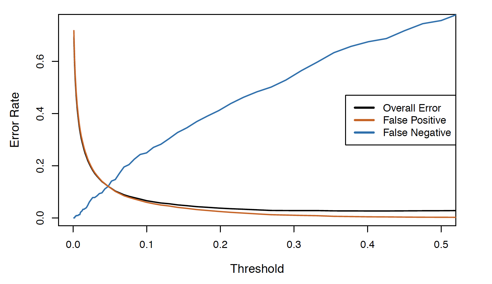
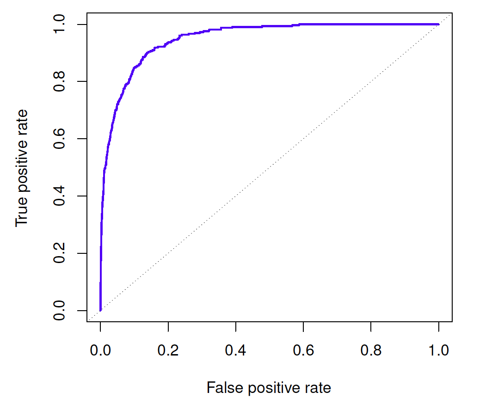

```{r child = "setup.Rmd"}
```

layout: true

<div class="my-footer">
<span>
Dr. Lucy D'Agostino McGowan <i>adapted from slides by Hastie & Tibshirani</i>
</span>
</div> 

```{r, echo = FALSE, message = FALSE, warning = FALSE}
knitr::opts_chunk$set(echo = FALSE, message = FALSE, warning = FALSE)
library(tidyverse)
library(broom)
library(gridExtra)
library(ISLR)
```

---

## <i class="fas fa-laptop"></i> `LDA`

- Go to the [sta-363-s20 GitHub organization](https://github.com/sta-363-s20) and search for `appex-02-lda`
- Clone this repository into RStudio Cloud

---

```{r, fig.height = 2}
p1 <- ggplot(data.frame(x = c(-4, 4)), aes(x)) + 
  stat_function(fun = dnorm, args = list(mean = -1.5, sd = 1), col = 'cornflower blue') +
  stat_function(fun = dnorm, args = list(mean = 1.5, sd = 1), col = 'orange') + 
  geom_vline(xintercept = 0, lty = 2, lwd = 1.5) +
  theme_classic() + 
  theme(axis.title.y = element_blank(),
        axis.text.y = element_blank(),
        axis.ticks.y  = element_blank()) +
  labs(title = expression(pi[1] == 0.5~pi[2] == 0.5))
p2 <- ggplot(data.frame(x = c(-4, 4)), aes(x)) + 
  stat_function(fun = ~ dnorm(.x, mean = -1.5, sd = 1) * .3, col = 'cornflower blue') +
  stat_function(fun = ~dnorm(.x, mean = 1.5, sd = 1) * .7,  col = 'orange') + 
  geom_vline(xintercept = -.25, lty = 2, lwd = 1.5) +
  theme_classic() + 
  theme(axis.title.y = element_blank(),
        axis.text.y = element_blank(),
        axis.ticks.y  = element_blank()) + 
    labs(title = expression(pi[1] == 0.3~pi[2] == 0.7))
set.seed(10)
d <- data.frame(
  x = c(rnorm(20, -1.5), rnorm(20, 1.5)),
  y = rep(c("A", "B"), each = 20)
)
p3 <- ggplot(d, aes(x, fill = y)) +
  geom_histogram(bins = 16) + 
  theme_classic() +
  theme(legend.position = "none")  + 
  scale_fill_manual(values = c("cornflower blue", "orange")) + 
  geom_vline(xintercept = 0, lwd = 1.5, lty = 2) + 
  geom_vline(xintercept = (mean(d$x[d$y == "A"])+mean(d$x[d$y == "B"]))/2, lwd = 1.5)
grid.arrange(p1, p3, ncol = 2)
```

* $\mu_1 = -1.5$
* $\mu_2 = 1.5$
* $\pi_1=\pi_2=0.5$
* $\sigma^2=1$
--

* typically we don't know the **true** parameters, we just use our training data to estimate them

---

## Estimating parameters

$$\hat{\pi}_k = \frac{n_k}{n}$$
--

$$\hat{\mu}_k = \frac{1}{n_k}\sum_{i:y_i=k}x_i$$

--

$$
\begin{align}
\hat{\sigma}^2 &= \frac{1}{n-K}\sum_{k=1}^K\sum_{i:y_i=k}(x_i-\hat{\mu_k})^2\\
&=\sum_{k=1}^K\frac{n_k-1}{n-K}\hat\sigma^2_k
\end{align}
$$

--

$$\hat{\sigma}_k^2= \frac{1}{n_k-1}\sum_{i:y_i=k}(x_i-\hat{\mu}_k)^2$$

---

## Estimating parameters (in R!)

x | -1.6| 0.2| -0.9| -2.0| -3.0| 1.9| 1.2| 2.2| 2.7| -0.5 | 1.8 | 3.3 | 5.0 | 3.4 | 4.2
--|--|--|--|--|--|--|--|--|--|--|--|--|--|--|--
y | 1 | 1 | 1| 1| 1| 2|2|2|2|2|3|3|3|3|3


$$\hat{\pi}_k = \frac{n_k}{n}$$
```{r}
df <- tibble(x = c(-1.6, 0.2, -0.9, -2, -3, 1.9, 1.2, 2.2, 2.7, -0.5, 1.8, 3.3, 5.0, 3.4, 4.2),
             y = rep(c(1, 2, 3), each = 5))
```

```{r, echo = TRUE}
df %>%
  group_by(y) %>%
  summarise(n = n()) %>%
  mutate(pi = n / sum(n))
```

---

## Estimating parameters (in R!)

x | -1.6| 0.2| -0.9| -2.0| -3.0| 1.9| 1.2| 2.2| 2.7| -0.5 | 1.8 | 3.3 | 5.0 | 3.4 | 4.2
--|--|--|--|--|--|--|--|--|--|--|--|--|--|--|--
y | 1 | 1 | 1| 1| 1| 2|2|2|2|2|3|3|3|3|3

$$\hat{\pi}_k = \frac{n_k}{n}$$

.pull-left[

```{r, echo = TRUE}
df %>%
  group_by(y) %>% #<<
  summarise(n = n()) %>%
  mutate(pi = n / sum(n))
```
]

.pull-right[
* `group_by()`: do calculations on groups
]
---

## Estimating parameters (in R!)

x | -1.6| 0.2| -0.9| -2.0| -3.0| 1.9| 1.2| 2.2| 2.7| -0.5 | 1.8 | 3.3 | 5.0 | 3.4 | 4.2
--|--|--|--|--|--|--|--|--|--|--|--|--|--|--|--
y | 1 | 1 | 1| 1| 1| 2|2|2|2|2|3|3|3|3|3

$$\hat{\pi}_k = \frac{n_k}{n}$$

.pull-left[

```{r, echo = TRUE}
df %>%
  group_by(y) %>%
  summarise(n = n()) %>% #<<
  mutate(pi = n / sum(n))
```

]

.pull-right[
* `group_by()`: do calculations on groups
* `summarise()`: reduce variables to values
]
---


## Estimating parameters (in R!)

x | -1.6| 0.2| -0.9| -2.0| -3.0| 1.9| 1.2| 2.2| 2.7| -0.5 | 1.8 | 3.3 |5.0 | 3.4 | 4.2
--|--|--|--|--|--|--|--|--|--|--|--|--|--|--|--
y | 1 | 1 | 1| 1| 1| 2|2|2|2|2|3|3|3|3|3

$$\hat{\pi}_k = \frac{n_k}{n}$$

.pull-left[

```{r, echo = TRUE}
df %>%
  group_by(y) %>%
  summarise(n = n()) %>% 
  mutate(pi = n / sum(n)) #<<
```

]

.pull-right[
* `group_by()`: do calculations on groups
* `summarise()`: reduce variables to values
* `mutate()`: add new variables
]
---

## Estimating parameters (in R!)

x | -1.6| 0.2| -0.9| -2.0| -3.0| 1.9| 1.2| 2.2| 2.7| -0.5 | 1.8 | 3.3 |5.0 | 3.4 | 4.2
--|--|--|--|--|--|--|--|--|--|--|--|--|--|--|--
y | 1 | 1 | 1| 1| 1| 2|2|2|2|2|3|3|3|3|3

$$\hat{\pi}_k = \frac{n_k}{n}$$

.pull-left[

```{r, echo = TRUE, eval = FALSE}
df %>%
  group_by(y) %>%
  summarise(n = n()) %>% 
  mutate(pi = n / sum(n)) 
```

]

.pull-right[
* `group_by()`: do calculations on groups
* `summarise()`: reduce variables to values
* `mutate()`: add new variables
]

.question[
How do we pull $\pi_k$ out into their own R object?
]

---

## Estimating parameters (in R!)

x | -1.6| 0.2| -0.9| -2.0| -3.0| 1.9| 1.2| 2.2| 2.7| -0.5 | 1.8 | 3.3 |5.0 | 3.4 | 4.2
--|--|--|--|--|--|--|--|--|--|--|--|--|--|--|--
y | 1 | 1 | 1| 1| 1| 2|2|2|2|2|3|3|3|3|3

$$\hat{\pi}_k = \frac{n_k}{n}$$

```{r, echo = TRUE}
df %>%
  group_by(y) %>%
  summarise(n = n()) %>% 
  mutate(pi = n / sum(n)) %>%
  pull(pi) -> pi #<<
```


.question[
How do we pull $\pi_k$ out into their own R object?
]

---

## Estimating parameters (in R!)

x | -1.6| 0.2| -0.9| -2.0| -3.0| 1.9| 1.2| 2.2| 2.7| -0.5 | 1.8 | 3.3 |5.0 | 3.4 | 4.2
--|--|--|--|--|--|--|--|--|--|--|--|--|--|--|--
y | 1 | 1 | 1| 1| 1| 2|2|2|2|2|3|3|3|3|3

$$\hat{\pi}_k = \frac{n_k}{n}$$

```{r, echo = TRUE}
pi
```

.question[
How do we pull $\pi_k$ out into their own R object?
]
---

## Estimating parameters (in R!)

x | -1.6| 0.2| -0.9| -2.0| -3.0| 1.9| 1.2| 2.2| 2.7| -0.5 | 1.8 | 3.3 | 5.0 | 3.4 | 4.2
--|--|--|--|--|--|--|--|--|--|--|--|--|--|--|--
y | 1 | 1 | 1| 1| 1| 2|2|2|2|2|3|3|3|3|3

$$\hat{\mu}_k = \frac{1}{n_k}\sum_{i:y_i=k}x_i$$

```{r, echo = TRUE}
df %>%
  group_by(y) %>%
  summarise(mu = mean(x)) #<<
```

---

## Estimating parameters (in R!)

x | -1.6| 0.2| -0.9| -2.0| -3.0| 1.9| 1.2| 2.2| 2.7| -0.5 | 1.8 | 3.3 | 5.0 | 3.4 | 4.2
--|--|--|--|--|--|--|--|--|--|--|--|--|--|--|--
y | 1 | 1 | 1| 1| 1| 2|2|2|2|2|3|3|3|3|3

$$\hat{\mu}_k = \frac{1}{n_k}\sum_{i:y_i=k}x_i$$

```{r, echo = TRUE}
df %>%
  group_by(y) %>%
  summarise(mu = mean(x)) %>%
  pull(mu) -> mu #<<
```

---

## Estimating parameters (in R!)

x | -1.6| 0.2| -0.9| -2.0| -3.0| 1.9| 1.2| 2.2| 2.7| -0.5 | 1.8 | 3.3 | 5.0 | 3.4 | 4.2
--|--|--|--|--|--|--|--|--|--|--|--|--|--|--|--
y | 1 | 1 | 1| 1| 1| 2|2|2|2|2|3|3|3|3|3

$$
\begin{align}
\hat{\sigma}^2 =\sum_{k=1}^K\frac{n_k-1}{n-K}\hat\sigma^2_k
\end{align}
$$

.small[

```{r, echo = TRUE}
df %>%
  group_by(y) %>%
  summarise(var_k = var(x),
            n = n()) %>%
  mutate(v = ((n - 1) / (sum(n) - 3)) * var_k) %>%
  summarise(sigma_sq = sum(v))
```

]

---

## Estimating parameters (in R!)

x | -1.6| 0.2| -0.9| -2.0| -3.0| 1.9| 1.2| 2.2| 2.7| -0.5 | 1.8 | 3.3 | 5.0 | 3.4 | 4.2
--|--|--|--|--|--|--|--|--|--|--|--|--|--|--|--
y | 1 | 1 | 1| 1| 1| 2|2|2|2|2|3|3|3|3|3

$$
\begin{align}
\hat{\sigma}^2 =\sum_{k=1}^K\frac{n_k-1}{n-K}\hat\sigma^2_k
\end{align}
$$

```{r, echo = TRUE}
df %>%
  group_by(y) %>%
  summarise(var_k = var(x),
            n = n()) %>%
  mutate(v = ((n - 1) / (sum(n) - 3)) * var_k) %>%
  summarise(sigma_sq = sum(v)) %>%
  pull(sigma_sq) -> sigma_sq
```

---

## Estimating parameters (in R!)

x | -1.6| 0.2| -0.9| -2.0| -3.0| 1.9| 1.2| 2.2| 2.7| -0.5 | 1.8 | 3.3 | 5.0 | 3.4 | 4.2
--|--|--|--|--|--|--|--|--|--|--|--|--|--|--|--
y | 1 | 1 | 1| 1| 1| 2|2|2|2|2|3|3|3|3|3

$$\delta_k(x) = x \frac{\mu_k}{\sigma^2}-\frac{\mu_k^2}{2\sigma^2}+\log(\pi_k)$$

* Let's predict the class for $x = 2$
```{r, echo = TRUE}
x <- 2
x * (mu / sigma_sq) - mu^2 / (2 * sigma_sq) + log(pi)
```

--
.question[
Which class should we give this point?
]
---

## Estimating parameters (in R!)

x | -1.6| 0.2| -0.9| -2.0| -3.0| 1.9| 1.2| 2.2| 2.7| -0.5 | 1.8 | 3.3 | 5.0 | 3.4 | 4.2
--|--|--|--|--|--|--|--|--|--|--|--|--|--|--|--
y | 1 | 1 | 1| 1| 1| 2|2|2|2|2|3|3|3|3|3

$$\delta_k(x) = x \frac{\mu_k}{\sigma^2}-\frac{\mu_k^2}{2\sigma^2}+\log(\pi_k)$$

* Let's predict the class for $x = 6$
```{r, echo = TRUE}
x <- 6
x * (mu / sigma_sq) - mu^2 / (2 * sigma_sq) + log(pi)
```

--
.question[
Which class should we give this point?
]

---

## From the discriminant score to probabilities

We can turn $\hat{\delta}_k(x)$ into estimates for class probabilities

--

$$\hat{P}(Y=k|X=x)=\frac{e^{\hat{\delta}_k(x)}}{\sum_{l=1}^Ke^{\hat{\delta}_l(x)}}$$

--
* Classifying the largest $\hat{\delta}_k(x)$ is the same as classifying to the class with the largest $\hat{P}(Y=k|X=x)$
--

* For $K=2$:
  * classify to 2 if $\hat{P}(Y=2|X=x)\ge 0.5$
  * classify to 1 otherwise

---


## Estimating parameters (in R!)

x | -1.6| 0.2| -0.9| -2.0| -3.0| 1.9| 1.2| 2.2| 2.7| -0.5 | 1.8 | 3.3 | 5.0 | 3.4 | 4.2
--|--|--|--|--|--|--|--|--|--|--|--|--|--|--|--
y | 1 | 1 | 1| 1| 1| 2|2|2|2|2|3|3|3|3|3


$$\hat{P}(Y=k|X=x)=\frac{e^{\hat{\delta}_k(x)}}{\sum_{l=1}^Ke^{\hat{\delta}_l(x)}}$$

* Let's get the posterior probability of each class for $x = 6$

.small[
```{r, echo = TRUE}
x <- 6
d <- x * (mu / sigma_sq) - mu^2 / (2 * sigma_sq) + log(pi)
exp(d) / sum(exp(d))
```
]

---

## Estimating parameters (in R!)

x | -1.6| 0.2| -0.9| -2.0| -3.0| 1.9| 1.2| 2.2| 2.7| -0.5 | 1.8 | 3.3 | 5.0 | 3.4 | 4.2
--|--|--|--|--|--|--|--|--|--|--|--|--|--|--|--
y | 1 | 1 | 1| 1| 1| 2|2|2|2|2|3|3|3|3|3

* There is a function to do this in R called `lda()` in the **MASS** package

.small[
```{r, echo = TRUE}
library(MASS) #<<
model <- lda(y ~ x, data = df)
```
]

---


## Estimating parameters (in R!)

x | -1.6| 0.2| -0.9| -2.0| -3.0| 1.9| 1.2| 2.2| 2.7| -0.5 | 1.8 | 3.3 | 5.0 | 3.4 | 4.2
--|--|--|--|--|--|--|--|--|--|--|--|--|--|--|--
y | 1 | 1 | 1| 1| 1| 2|2|2|2|2|3|3|3|3|3

* There is a function to do this in R called `lda()` in the **MASS** package

.small[
```{r, echo = TRUE}
library(MASS) 
model <- lda(y ~ x, data = df)
predict(model, newdata = data.frame(x = 6)) #<<
```
]

---

## <i class="fas fa-laptop"></i> `LDA`

- Go to the [sta-363-s20 GitHub organization](https://github.com/sta-363-s20) and search for `appex-02-lda`
- Clone this repository into RStudio Cloud
- Complete the exercises
- **Knit, Commit, Push**

---

## Linear discriminant analysis $p>1$



* When $p>1$ the density takes on the **multivariate normal** density

$$f(x) = \frac{1}{(2\pi)^{p/2}|\mathbf\Sigma|^{1/2}}e^{-\frac{1}{2}(x-\mu)^T\mathbf\Sigma^{-1}(x-\mu)}$$

---

## Linear discriminant analysis $p>1$


* The **discriminant function** is now

$$\delta_k(x)=x^T\mathbf\Sigma^{-1}\mu_k-\frac{1}{2}\mu_k^T\mathbf\Sigma^{-1}\mu_k+\log\pi_k$$

* This is still a linear function!

---

## Example $p = 2$, $K = 3$



* Here $\pi_1 = \pi_2 = \pi_3 = 1/3$
* The dashed lines the Bayes decision boundaries
  * If they were known, they would yield the fewest misclassification errors, among all possible classifiers.
  
---

## LDA on Credit Data

| True Default (No) | True Default (Yes) | Total
-|------------------|---------------------|-----
**Predicted Default (No)** | 9644 | 252| 9895
**Predicted Default (Yes)** | 23 | 81 | 104
**Total** | 9667 | 333 | 10000

.question[
What is the misclassification rate?
]

--

* $\frac{23 + 252}{10000}$ errors - $2.75\%$ misclassification
--

.question[
Since this is **training error** what is a possible concern?
]

--
* This could be **overfit**

---

## LDA on Credit Data

| True Default (No) | True Default (Yes) | Total
-|------------------|---------------------|-----
**Predicted Default (No)** | 9644 | 252| 9895
**Predicted Default (Yes)** | 23 | 81 | 104
**Total** | 9667 | 333 | 10000


* $\frac{23 + 252}{10000}$ errors - $2.75\%$ misclassification
* ~~This could be **overfit**~~
* Since we have a **large n** and **small p** ( $n = 10,000$, $p = 4$ ) we aren't too worried about overfitting

---

## LDA on Credit Data

| True Default (No) | True Default (Yes) | Total
-|------------------|---------------------|-----
**Predicted Default (No)** | 9644 | 252| 9895
**Predicted Default (Yes)** | 23 | 81 | 104
**Total** | 9667 | 333 | 10000


* $\frac{23 + 252}{10000}$ errors - $2.75\%$ misclassification
--

.question[
What would the error rate be if we classified to the _prior_, `No` default?
]

--
* $333/10000$ - $3.33\%$

---

## LDA on Credit Data

| True Default (No) | True Default (Yes) | Total
-|------------------|---------------------|-----
**Predicted Default (No)** | 9644 | 252| 9895
**Predicted Default (Yes)** | 23 | 81 | 104
**Total** | 9667 | 333 | 10000


* $\frac{23 + 252}{10000}$ errors - $2.75\%$ misclassification
* Since we have a **large n** and **small p** ( $n = 10,000$, $p = 4$ ) we aren't too worried about overfitting
* Of the true `No`'s, we make $23/9667 = 0.2\%$ errors; of the
true `Yes`'s, we make $252/333 = 75.7\%$ errors!

---

## Types of errors

* **False positive rate**: The fraction of truly negative that are classified as positive
* **False negative rate**: The fraction of truly positive that are classified as negative

--

.question[
What is the false positive rate in the Credit Default example?
]

--
* 0.2%

--

.question[
What is the false negative rate in the Credit Default example?
]

--
* 75.7%

---

## Types of errors

* **False positive rate**: The fraction of truly negative that are classified as positive
* **False negative rate**: The fraction of truly positive that are classified as negative
* The Credit Default table was created by predicting the `Yes` class if

$$\hat{P}(\texttt{Default}|\texttt{Balance, Student})\ge 0.5$$
--
* We can change the two error rates by changing the **threshold** from 0.5 to some other number between 0 and 1

$$\hat{P}(\texttt{Default}|\texttt{Balance, Student})\ge threshold$$

---

## Varying the _threshold_



* To reduce the **false negative rate** we may want the threshold to be 0.1 or less

---

## ROC

.pull-left[

]


.pull-right[

* A receiver operating characteristic (ROC) curve looks at both simultaneously
* The area under the ROC curve (AUC) is sometimes a metric for performance

]

--

.question[
Which do you think is better, higher or lower AUC?
]

---

## Let's see it in R

.small[
```{r, echo = TRUE}
library(MASS)
model <- lda(default ~ balance + student + income, data = Default)
```

]

* Use the `lda()` function in R from the **MASS** package

---

## Let's see it in R

.small[
```{r, echo = TRUE}
library(MASS)
model <- lda(default ~ balance + student + income, data = Default)
predictions <- predict(model) #<<
```

]

* Use the `lda()` function in R from the `MASS` package
* Get the predicted classes along with posterior probabilities using the `predict()` function

---

## Let's see it in R

.small[
```{r, echo = TRUE, eval = FALSE}
library(MASS)
model <- lda(default ~ balance + student + income, data = Default)
predictions <- predict(model)
Default %>%
  mutate(predicted_class = predictions$class) #<<
```
]

* Use the `lda()` function in R from the `MASS` package
* Get the predicted classes along with posterior probabilities using the `predict()` function
* Add the predicted class using the `mutate()` function

---

## Let's see it in R

.small[
```{r, echo = TRUE}
library(MASS)
model <- lda(default ~ balance + student + income, data = Default)
predictions <- predict(model)
Default %>%
  mutate(predicted_class = predictions$class) %>%
  summarise(fpr = 
              sum(default == "No" & predicted_class == "Yes") / #<<
              sum(default == "No"), #<<
            fnr = 
              sum(default == "Yes" & predicted_class == "No") / #<<
              sum(default == "Yes")) #<<
```
]

* Use the `summarise()` function to add the false positive and false negative rates

---

## Let's see it in R

.small[ 

```{r, echo = TRUE}
library(MASS)
library(tidymodels) #<<
model <- lda(default ~ balance + student + income, data = Default)
predictions <- predict(model)
Default %>%
  mutate(predicted_class = predictions$class) %>%
  conf_mat(default, predicted_class) %>% #<<
  autoplot(type = "heatmap") #<<
```

]

---

## Let's see it in R

* `conf_mat()` expects your outcome to be a factor variable

```{r, echo = TRUE, eval = FALSE}
library(MASS)
library(tidymodels) #<<
model <- lda(default ~ balance + student + income, data = Default)
predictions <- predict(model)
Default %>%
  mutate(predicted_class = predictions$class,
         default = as.factor(default)) %>% #<<
  conf_mat(default, predicted_class) %>% 
  autoplot(type = "heatmap") 
```
