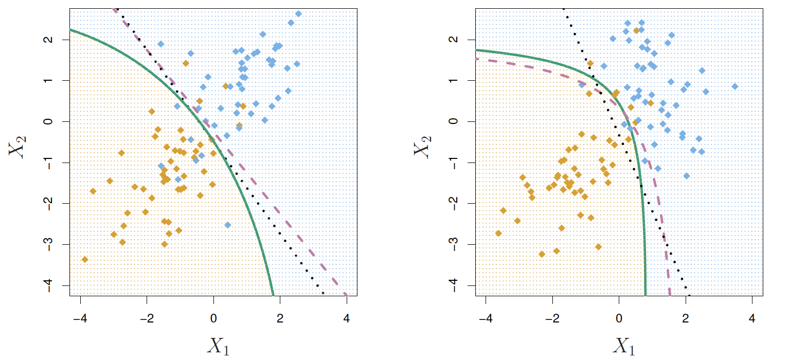

```{r child = "setup.Rmd"}
```

layout: true

<div class="my-footer">
<span>
Dr. Lucy D'Agostino McGowan <i>adapted from slides by Hastie & Tibshirani</i>
</span>
</div> 

```{r, echo = FALSE, message = FALSE, warning = FALSE}
knitr::opts_chunk$set(echo = FALSE, message = FALSE, warning = FALSE)
library(tidyverse)
library(broom)
library(gridExtra)
library(ISLR)
```

## Other forms of discriminant analysis

$$P(Y|X) = \frac{\pi_kf_k(x)}{\sum_{l=1}^K\pi_lf_l(x)}$$

--

* When $f_k(x)$ are **normal** densities with the **same covariance** matrix $\mathbf\Sigma$ in each class, this is **linear discriminant analysis**
--

* When $f_k(x)$ are **normal** densities with **different covariance** matrices $\mathbf\Sigma_k$ in each class, this is **quadratic discriminant analysis**
--

* Lots of other forms are possible! 

---

## Quadratic Discriminant Analysis

</img>

$$\delta_k(x) = -\frac{1}{2}(x-\mu_k)^T\mathbf\Sigma_k^{-1}(x-\mu_k)+\log\pi_k$$
.question[
Why do you think this is called **quadratic** discriminant analysis?
]
--

* Because the $\mathbf\Sigma_k$ are different, the quadratic terms matter

---


## Let's see it in R

.small[
```{r, echo = TRUE}
library(MASS)
model <- qda(default ~ balance + student, data = Default) #<<
predictions <- predict(model)
```

]

* Use the `qda()` function in R from the **MASS** package

---

## Let's see it in R

* Let's use LDA to visualize the data

.small[

```{r, echo = TRUE}
model <- lda(Species ~ ., data = iris) #<<
predictions <- predict(model)
```

]

---

## Let's see it in R

* Let's use LDA to visualize the data

.small[

```{r, echo = TRUE}
model <- lda(Species ~ ., data = iris) 
predictions <- predict(model)
plot_data <- data.frame(outcome = iris$Species, #<<
                        lda = predictions$x) #<<
head(plot_data)
```

]
---

## Let's see it in R

* Let's use LDA to visualize the data

.small[

```{r, echo = TRUE, fig.height = 2}
ggplot(data = plot_data, #<<
       mapping = aes(x = lda.LD1, y = lda.LD2, color = outcome)) + #<<
  geom_point() #<<
```

]

---

## ggplot2 $\in$ tidyverse

.pull-left[

]
.pull-right[
- **ggplot2** is tidyverse's data visualization package
- The `gg` in "ggplot2" stands for Grammar of Graphics
- It is inspired by the book **Grammar of Graphics** by Leland Wilkinson <sup>†</sup>
- A grammar of graphics is a tool that enables us to concisely describe the components of a graphic

]

.footnote[ 
<sup>†</sup> Source: [BloggoType](http://bloggotype.blogspot.com/2016/08/holiday-notes2-grammar-of-graphics.html)
]

---

## ggplot2

.question[
What function creates the plot?
]

.small[

```{r, echo = TRUE, fig.height = 2}
ggplot(data = plot_data, 
       mapping = aes(x = lda.LD1, y = lda.LD2, color = outcome)) + 
  geom_point() +
  labs(x = "LD1", y = "LD2")
```

]

---

## ggplot2

.question[
What data set is being plotted?
]

.small[

```{r, echo = TRUE, fig.height = 2}
ggplot(data = plot_data, 
       mapping = aes(x = lda.LD1, y = lda.LD2, color = outcome)) + 
  geom_point() +
  labs(x = "LD1", y = "LD2")
```

]

---

## ggplot2

.question[
Which variables are on the x- and y-axis?
]

.small[

```{r, echo = TRUE, fig.height = 2}
ggplot(data = plot_data, 
       mapping = aes(x = lda.LD1, y = lda.LD2, color = outcome)) + 
  geom_point() +
  labs(x = "LD1", y = "LD2")
```

]

---

## ggplot2

.question[
What variable in the dataset determines the color?
]

.small[

```{r, echo = TRUE, fig.height = 2}
ggplot(data = plot_data, 
       mapping = aes(x = lda.LD1, y = lda.LD2, color = outcome)) + 
  geom_point() +
  labs(x = "LD1", y = "LD2")
```

]

---

## ggplot2

.question[
What does `geom_point()` mean?
]

.small[

```{r, echo = TRUE, fig.height = 2}
ggplot(data = plot_data, 
       mapping = aes(x = lda.LD1, y = lda.LD2, color = outcome)) + 
  geom_point() +
  labs(x = "LD1", y = "LD2")
```

]

---


## Hello ggplot2!

- `ggplot()` is the main function in ggplot2 and plots are constructed in layers
- The structure of the code for plots can often be summarized as
```{r eval = FALSE, echo = TRUE}
ggplot + 
  geom_xxx
```

--

or, more precisely

.small[
```{r eval = FALSE, echo = TRUE}
ggplot(data = [dataset], mapping = aes(x = [x-variable], y = [y-variable])) +
  geom_xxx() +
  other options
```
]

---

## Hello ggplot2!

- To use ggplot2 functions, first load tidyverse

```{r}
library(tidyverse)
```

--

- For help with the ggplot2, see [ggplot2.tidyverse.org](http://ggplot2.tidyverse.org/)

---

```{r, fig.height = 2}
ggplot(data = plot_data,
       mapping = aes(x = lda.LD1, y = lda.LD2, color = outcome)) + 
  geom_point() 
```

* What is going on here?

--
* LDA is projecting the samples $X$ onto a _hyperplane_ with $K-1$ dimensions.

--
.question[
What is K here?
]
---


```{r, fig.height = 2}
ggplot(data = plot_data,
       mapping = aes(x = lda.LD1, y = lda.LD2, color = outcome)) + 
  geom_point() 
```

* What is going on here?
* LDA is projecting the samples $X$ onto a _hyperplane_ with $K-1$ dimensions.
* Why does this work?
* LDA essentially classifies to the closest centroid, and they span a K - 1 dimensional plane.
--

* Even when K > 3, we can find the "best" 2-dimensional plane for vizualizing the discriminant rule by using the first two discriminant variables (LD1 and LD2)

---

## Logistic Regression versus LDA

* For the two-class problem ( $K=2$ ), LDA takes the form

$$\log\left(\frac{p_1(x)}{1-p_1(x)}\right)=\log\left(\frac{p_1}{p_2}\right) = c_0 + c_1x_1 + \dots+ c_px_p$$
--

* This is the same form as logistic regression
--

* The difference is in how the parameters are estimated
--

  * Logistic regression uses the conditional likelihood based on
$P(Y|X)$ (**discriminative learning**)
--

  * LDA uses the full likelihood based on $P(X,Y)$ (**generative learning**)
--

  * The results are often similar
  
---

## Summary


* Logistic regression is very popular for classification, especially when $K = 2$ 
* LDA is useful when $n$ is small, or the classes are well separated, and normality assumptions are reasonable. Also when $K > 2$
--

* QDA is _similar_ to LDA, but it is more flexible because it allows the covariance of the predictors to be different for each class, $k$

--
* See Section 4.5 in your book for some comparisons of logistic regression, LDA, and KNN.