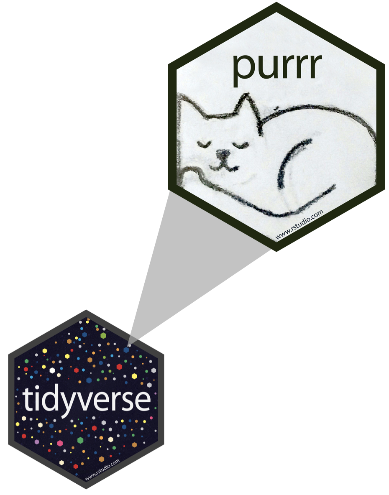

```{r child = "setup.Rmd"}
```

layout: true

<div class="my-footer">
<span>
Dr. Lucy D'Agostino McGowan <i>adapted from slides by Hastie & Tibshirani</i>
</span>
</div> 

```{r, echo = FALSE, message = FALSE, warning = FALSE}
knitr::opts_chunk$set(echo = FALSE, message = FALSE, warning = FALSE)
library(tidyverse)
library(ISLR)
library(tidymodels)
```

---

## <i class="fas fa-laptop"></i> `CV`

- Go to the [sta-363-s20 GitHub organization](https://github.com/sta-363-s20) and search for `appex-03-cv`
- Clone this repository into RStudio Cloud

---

## Cross validation

### `r emo::ji("bulb")` Big idea

* We have determined that it is sensible to use a _test_ set to calculate metrics like prediction error

--

.question[
Why?
]

---

## Cross validation 

### `r emo::ji("bulb")` Big idea

* We have determined that it is sensible to use a _test_ set to calculate metrics like prediction error

.question[
How have we done this so far?
]

---

## Cross validation

### `r emo::ji("bulb")` Big idea

* We have determined that it is sensible to use a _test_ set to calculate metrics like prediction error
* What if we don't have a seperate data set to test our model on?
--

* `r emo::ji("tada")` We can use **resampling** methods to **estimate** the test-set prediction error

---

## Training error versus test error

.question[
What is the difference? Which is typically larger?
]

--

* The **training error** is calculated by using the same observations used to fit the statistical learning model
--

* The **test error** is calculated by using a statistical learning method to predict the response of **new** observations
--

* The **training error rate** typically _underestimates_ the true prediction error rate

---


---

## Estimating prediction error

* Best case scenario: We have a large data set to test our model on 
--

* This is not always the case!

--

`r emo::ji("bulb")` Let's instead find a way to estimate the test error by holding out a subset of the training observations from the model fitting process, and then applying the statistical learning method to those held out observations

---

## Approach #1: Validation set 

* Randomly divide the available set up samples into two parts: a **training set** and a **validation set**
--

* Fit the model on the **training set**, calculate the prediction error on the **validation set**

--

.question[
If we have a **quantitative predictor** what metric would we use to calculate this test error?
]

--

* Often we use Mean Squared Error (MSE)

---


## Approach #1: Validation set 

* Randomly divide the available set up samples into two parts: a **training set** and a **validation set**
* Fit the model on the **training set**, calculate the prediction error on the **validation set**

.question[
If we have a **qualitative predictor** (classification) what metric would we use to calculate this test error?
]

--

* Often we use misclassification rate

---

## Approach #1: Validation set

Auto example: 
* We have 392 observations
* Trying to predict `mpg` from `horsepower`
* We can split the data in half and use 196 to fit the model and 192 to test 

```{r, fig.height = 2}
data(Auto)
set.seed(3)
f <- function() {
  samp <- sample(1:392, 196)
  train <- Auto[samp, ]
  test <- Auto[-samp, ]
  tibble(x = 1:15,
         y = map_dbl(1:15, mse, test = test, train = train)
  )
}
mse <- function(p = 1, test = test, train = train) {
  mean((test$mpg - predict(lm(mpg ~ poly(horsepower, degree = p), data = train), newdata = test))^2)
}
ggplot(f(), aes(x = x, y = y)) + 
  geom_line() +
  geom_point() + 
  labs(x = "degree polynomial", y = "MSE") + 
  theme_classic() + 
  ylim(c(15, 30))
```

---

## Approach #1: Validation set

Auto example: 
* We have 392 observations
* Trying to predict `mpg` from `horsepower`
* We can split the data in half and use 196 to fit the model and 192 to test - **what if we did this many times?**

```{r, fig.height = 2}
set.seed(1)
d <- map_df(1:10, ~ f())
d$z <- rep(LETTERS[1:10], each = 15)
ggplot(d, aes(x = x, y = y, group = z, color = z)) + 
  geom_line() +
  labs(x = "degree polynomial", y = "MSE") + 
  theme_classic() + 
  theme(legend.position = "none") +
  coord_cartesian(ylim = c(15, 30))
```

---

## Approach #1: Validation set (Drawbacks)

* the validation estimate of the test error can be highly variable, depending on which observations are included in the training set and which observations are included in the validation set
--

* In the validation approach, only a subset of the observations (those that are included in the training set rather than in the validation set) are used to fit the model

--
* Therefore, the validation set error may tend to **overestimate** the test error for the model fit on the entire data set

---

## Approach #2: K-fold cross validation

`r emo::ji("bulb")` The idea is to do the following:

*  Randomly divide the data into $K$ equal-sized parts
--

*  Leave out part $k$, fit the model to the other $K - 1$ parts (combined)
--

*  Obtain predictions for the left-out $k$th part
--

*  Do this for each part $k = 1, 2,\dots K$, and then combine the results

---

## Let's do it in R!

.small[
```{r, echo = TRUE}
sample(1:nrow(Auto))
```
]

---

## Let's do it in R!

.question[
What is this code doing?
]

.small[
```{r, echo = TRUE}
sample(1:nrow(Auto))
```
]

---

## Let's do it in R!

.small[
```{r, echo = TRUE, eval = FALSE}
K <- 5
Auto <- Auto %>%
  slice(sample(1:nrow(Auto))) %>% #<<
  mutate(k = rep(1:K, length.out = nrow(Auto)))
```
]

---

## Let's do it in R!

.small[
```{r, echo = TRUE, eval = FALSE}
K <- 5
Auto <- Auto %>%
  slice(sample(1:nrow(Auto))) %>% #<<
  mutate(k = rep(1:K, length.out = nrow(Auto))) #<<
```

]
---

## Let's do it in R!

.small[
```{r, echo = TRUE}
K <- 5
Auto <- Auto %>%
  slice(sample(1:nrow(Auto))) %>%
  mutate(k = rep(1:K, length.out = nrow(Auto)))
Auto %>%
  group_by(k) %>%
  summarise(n = n())
```
]

---

## Estimating prediction error

* Split the data into K parts, $C_1, C_2, \dots, C_k$

$$CV_{(K)} = \sum_{k=1}^K\frac{n_k}{n}MSE$$

--

* $MSE_k = \sum_{i \in C_k} (y_i - \hat{y}_i)^2/n_k$
--

* $n_k$ is the number of observations in group $k$
* $\hat{y}_i$ is the fit for observation $i$ obtained from the data with the part $k$ removed
--

* If we set $K = n$, we'd have $n-fold$ cross validation which is the same as **leave-one-out cross validation** (LOOCV)
---

## Let's see it in R!

.question[
What pieces of the equation have a _k_ in them?
]

--

```{r, echo = TRUE}
Auto1 <- Auto %>%
  filter(k != 1)
model1 <- lm(mpg ~ horsepower, data = Auto1)
Auto %>%
  filter(k == 1) %>%
  mutate(p = predict(model1, newdata = .)) %>%
  summarise(mse_1 = mean((mpg - p)^2),
            n_1 = n())
```

---


## Let's see it in R!

```{r, echo = TRUE}
Auto1 <- Auto %>% #<<
  filter(k != 1) #<<
model1 <- lm(mpg ~ horsepower, data = Auto1)
Auto %>%
  filter(k == 1) %>%
  mutate(p = predict(model1, newdata = .)) %>%
  summarise(mse_1 = mean((mpg - p)^2),
            n_1 = n())
```

---

## Let's see it in R!

```{r, echo = TRUE}
Auto1 <- Auto %>% 
  filter(k != 1) 
model1 <- lm(mpg ~ horsepower, data = Auto1) #<<
Auto %>%
  filter(k == 1) %>%
  mutate(p = predict(model1, newdata = .)) %>%
  summarise(mse_1 = mean((mpg - p)^2),
            n_1 = n())
```

---

## Let's see it in R!

```{r, echo = TRUE}
Auto1 <- Auto %>% 
  filter(k != 1) 
model1 <- lm(mpg ~ horsepower, data = Auto1)
Auto %>% #<<
  filter(k == 1) %>% #<<
  mutate(p = predict(model1, newdata = .)) %>%
  summarise(mse_1 = mean((mpg - p)^2),
            n_1 = n())
```

---

## Let's see it in R!

```{r, echo = TRUE}
Auto1 <- Auto %>%
  filter(k != 1) 
model1 <- lm(mpg ~ horsepower, data = Auto1)
Auto %>%
  filter(k == 1) %>%
  mutate(p = predict(model1, newdata = .)) %>% #<<
  summarise(mse_1 = mean((mpg - p)^2), 
            n_1 = n())
```

---

## Let's see it in R!

```{r, echo = TRUE}
Auto1 <- Auto %>% 
  filter(k != 1) 
model1 <- lm(mpg ~ horsepower, data = Auto1)
Auto %>%
  filter(k == 1) %>%
  mutate(p = predict(model1, newdata = .)) %>%
  summarise(mse_1 = mean((mpg - p)^2), #<<
            n_1 = n()) #<<
```

---


## Let's see it in R!

```{r, echo = TRUE}
Auto1 <- Auto %>% 
  filter(k != 1) 
model1 <- lm(mpg ~ horsepower, data = Auto1)
Auto %>%
  filter(k == 1) %>%
  mutate(p = predict(model1, newdata = .)) %>%
  summarise(mse_1 = mean((mpg - p)^2),
            n_1 = n()) 
```

* Now we just have to do this 4 more times! 
--
`r emo::ji("sweat_smile")`

---


class: center, middle

## `r emo::ji("+1")` If you have to copy/paste code more than 3 times, write a function!

---

## Let's see it in R!

```{r, echo = TRUE}
mse_k <- function(K = 1) { #<<
  Auto_k <- Auto %>% 
    filter(k != K) 
  model_k <- lm(mpg ~ horsepower, data = Auto_k)
  Auto %>%
    filter(k == K) %>% 
    mutate(p = predict(model_k, newdata = .)) %>%
    summarise(mse_k = mean((mpg - p)^2),
              n_k = n())
} #<<
```

---

## Let's see it in R!

```{r, echo = TRUE}
mse_k <- function(K = 1) { 
  Auto_k <- Auto %>% 
    filter(k != K) #<<
  model_k <- lm(mpg ~ horsepower, data = Auto_k)
  Auto %>%
    filter(k == K) %>% #<<
    mutate(p = predict(model_k, newdata = .)) %>%
    summarise(mse_k = mean((mpg - p)^2),
              n_k = n())
}  
```

---

## Let's see it in R!

```{r, echo = TRUE}
mse_k()
```

---

## Let's see it in R!

```{r, echo = TRUE}
mse_k(K = 1)
```

---

## Let's see it in R!

```{r, echo = TRUE}
mse_k(K = 1)
mse_k(K = 2)
mse_k(K = 3)
```

--
* Uh-oh we are copy/pasting again!

---

## purrr $\in$ tidyverse

.pull-left[

]
.pull-right[
- **purrr** is a package for _iterating_ in R
- The functions we will use are all `map_xxx()` functions 
]
---

## `map(.x, .f, ...)`

--

### for every element of `.x` do `.f`

---

## Example

.small[
```{r, echo = TRUE}
map(1:5, ~ .x * 2)
```
]

--

* By default, the output will be a **list**
--

* You can dictate your desired output type by specifying `map_xxx()` for example to output a numeric (double) vector, use `map_dbl()`

---

## Example

.small[
```{r, echo = TRUE}
map_dbl(1:5, ~ .x * 2)
```
]

---

## `map_xxx(.x, .f)`

* `map()`: list
* `map_dbl()`: double
* `map_int()`
* `map_lgl()`
* `map_chr()`
* `map_df()`

--

.question[
What do you think the rest of these output?
]

---

## `map_xxx(.x, .f)`

* `map()`: list
* `map_dbl()`: double
* `map_int()`: integer
* `map_lgl()`: logical
* `map_chr()`: character
* `map_df()`: data frame

.question[
What do you think the rest of these output?
]

---

## Back to our example!

.pull-left[
.small[
```{r, echo = TRUE}
map(1:K, ~ mse_k(.x))
```
]
]

.pull-right[
.question[
How can I get these into a data frame?
]
]
---

## Let's see it in R!

.small[
```{r, echo = TRUE}
map_df(1:K, ~ mse_k(.x))
```
]

--

.question[
What do I need to do with these to estimate the prediction error?
]

.small[
```{r, echo = TRUE}
map_df(1:K, ~ mse_k(.x)) %>%
  summarise(cv_5 = sum(n_k / sum(n_k) * mse_k))
```
]

---

## Special Case!

* With _linear_ regression, you can actually calculate the LOOCV error without having to iterate!

$$CV_{(n)} = \frac{1}{n}\sum_{i=1}^n\left(\frac{y_i-\hat{y}_i}{1-h_i}\right)^2$$

--

* $\hat{y}_i$ is the $i$th fitted value from the linear model 
--

* $h_i$ is the diagonal of the "hat" matrix (remember that! `r emo::ji("hat")`)

---

## Picking $K$

* $K$ can vary from 2 (splitting the data in half each time) to $n$ (LOOCV)
--

* LOOCV is sometimes useful but usually the estimates from each fold are very correlated, so their average can have a **high variance**
--

* A better choice tends to be $K=5$ or $K=10$

---

## Bias variance trade-off

* Since each training set is only $(K - 1)/K$ as big as the original training set, the estimates of prediction error will typically be **biased** upward

--
* This bias is minimized when $K = n$ (LOOCV), but this estimate has a **high variance**

--
* $K =5$ or $K=10$ provides a nice compromise for the bias-variance trade-off

---

## <i class="fas fa-laptop"></i> `CV`

- Go to the [sta-363-s20 GitHub organization](https://github.com/sta-363-s20) and search for `appex-03-cv`
- Clone this repository into RStudio Cloud
- Complete the exercises
- Remember to **knit, commit, push!**
