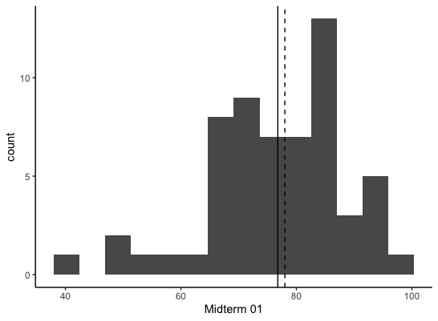

```{r child = "setup.Rmd"}
```

layout: true

<div class="my-footer">
<span>
Dr. Lucy D'Agostino McGowan
</span>
</div> 

---

class: center, middle

## [bit.ly/sta-363-s20-office-hours)](bit.ly/sta-363-s20-office-hours)


---
## Midterm 01

