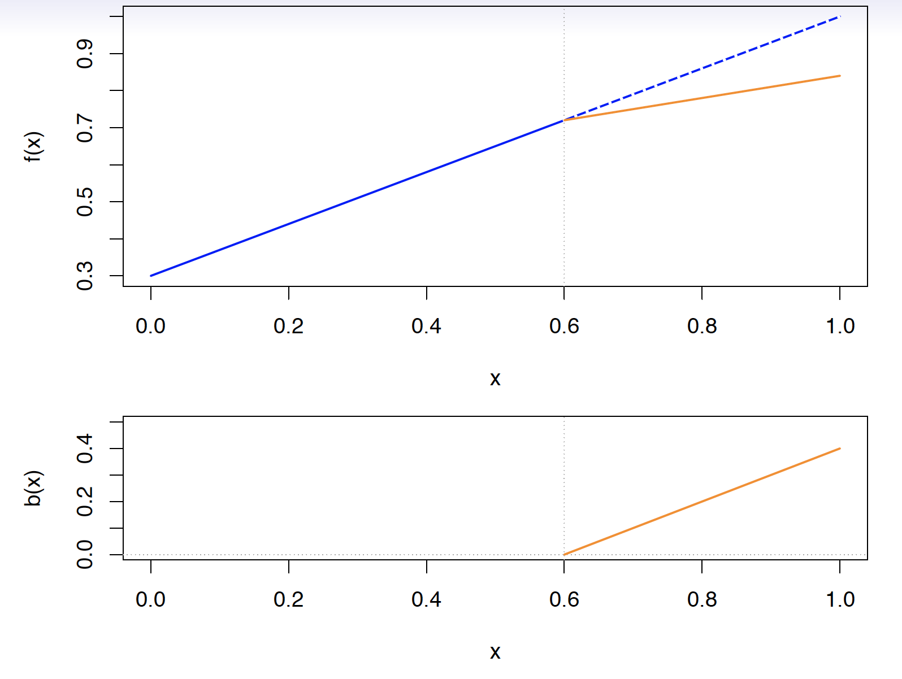
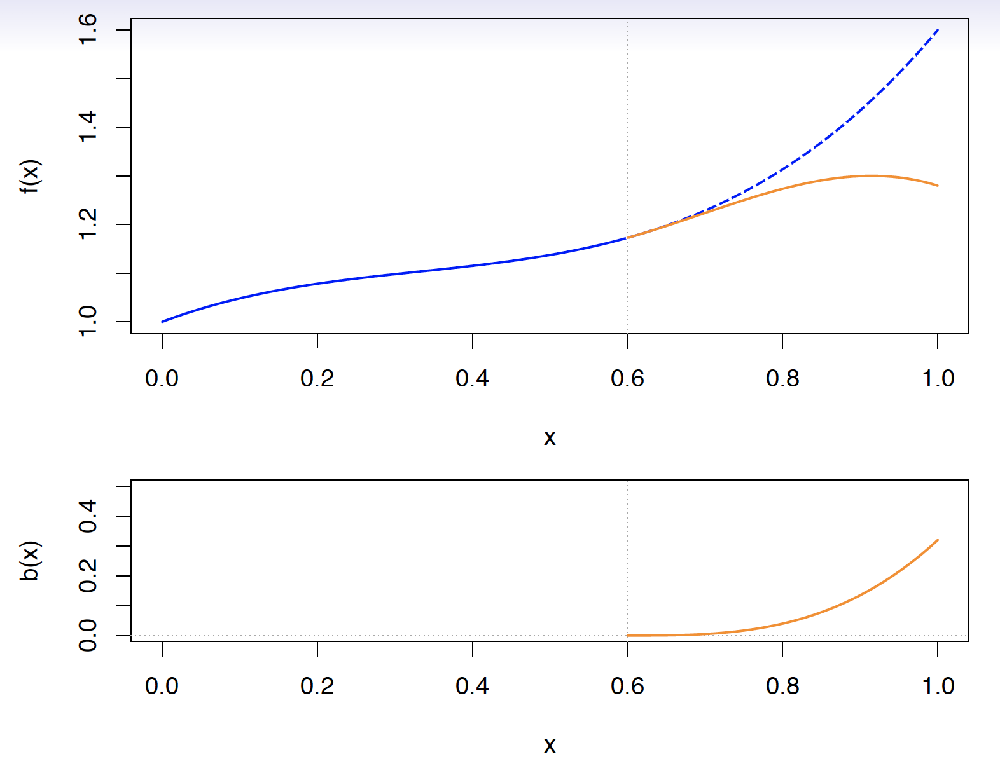
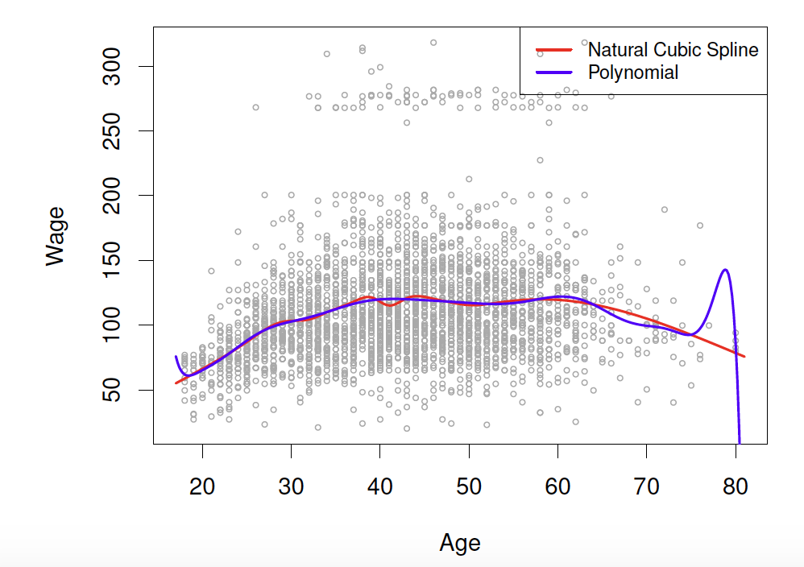

```{r child = "setup.Rmd"}
```

layout: true

<div class="my-footer">
<span>
Dr. Lucy D'Agostino McGowan <i> adapted from Alison Hill's Introduction to ML with the Tidyverse</i>
</span>
</div> 

```{r, echo = FALSE, message = FALSE, warning = FALSE}
knitr::opts_chunk$set(message = FALSE, warning = FALSE)
library(countdown)
library(ISLR)
library(tidymodels)
co <- read.table("http://data.princeton.edu/eco572/datasets/cohhpop.dat",
                 col.names=c("age","pop"), header=FALSE)

```

---

## Non-linear relationships

.question[
What have we used so far to deal with non-linear relationships?
]
--

* Hint: What did you use in Lab 03?
--

* Polynomials!

---

## Polynomials

$$y_i = \beta_0 + \beta_1x_i + \beta_2x_i^2+\beta_3x_i^3 \dots + \beta_dx_i^d+\epsilon_i$$


```{r, echo = FALSE}
ggplot(co, aes(age, pop)) + 
  geom_point() + 
  geom_smooth(formula = y ~ poly(x, 4), method = "lm")
```

--

* This is data from the Columbia World Fertility Survey (1975-76) to examine household compositions
--

* Fit here with a 4th degree polynomial 

---

## How is it done?

* New variables are created ( $X_1 = X$, $X_2 = X^2$, $X_3 = X^3$, etc) and treated as multiple linear regression
--

* We are _not_ interested in the individual coefficients, we are interested in how a _specific_ $x$ value behaves

$$\hat{f}(x_0) = \hat\beta_0 + \hat\beta_1x_0 + \hat\beta_2x_0^2 + \hat\beta_3x_0^3 + \hat\beta_4x_0^4$$

--

* _or more often a change between two values_, $a$ and $b$

$$\hat{f}(b) -\hat{f}(a) = \hat\beta_1b + \hat\beta_2b^2 + \hat\beta_3b^3 + \hat\beta_4b^4 - \hat\beta_1a - \hat\beta_2a^2 - \hat\beta_3a^3 -\hat\beta_4a^4$$

--

$$\hat{f}(b) -\hat{f}(a) =\hat\beta_1(b-a) + \hat\beta_2(b^2-a^2)+\hat\beta_3(b^3-a^3)+\hat\beta_4(b^4-a^4)$$

---

## Polynomial Regression 

$$\hat{f}(b) -\hat{f}(a) =\hat\beta_1(b-a) + \hat\beta_2(b^2-a^2)+\hat\beta_3(b^3-a^3)+\hat\beta_4(b^4-a^4)$$

.question[
How do you pick $a$ and $b$?
]

--

* If given no other information, a sensible choice may be the 25th and 75th percentiles of $x$

---

## Polynomial Regression 

```{r, echo = FALSE}
ggplot(co, aes(x = age, y = pop)) + 
  geom_point() + 
  geom_smooth(formula = y ~ poly(x, 4), method = "lm") + 
  geom_vline(xintercept = c(24.5, 73.5), lty = 2)
```

---


class: inverse

`r countdown::countdown(minutes = 3)`

## <i class="fas fa-laptop"></i> `Polynomial Regression`

$$pop = \beta_0 + \beta_1age + \beta_2age^2 + \beta_3age^3 +\beta_4age^4+ \epsilon$$

Using the information below, write out the equation to predicted change in population from a change in age from the 25th percentile (24.5) to a 75th percentile (73.5).

```{r, echo = FALSE, results = "asis"}
lm(pop ~ age + I(age^2) + I(age^3) + I(age^4), data = co) %>%
  tidy() %>%
  knitr::kable(digits = 4, format = "markdown")
```

---

## Choosing $d$

$$y_i = \beta_0 + \beta_1x_i + \beta_2x_i^2+\beta_3x_i^3 \dots + \beta_dx_i^d+\epsilon_i$$

## Either:

* Pre-specify $d$ (before looking `r emo::ji("eyes")` at your data!)
* Use cross-validation to pick $d$

--

.question[
Why?
]

---

## Polynomial Regression

* polynomials have notoriously bad tail behavior (so they can be bad for extrapolation)

--

.question[
What does this mean?
]

---

## Step functions

* Another way to create a transformation is to cut the variable into distinct regions

$$C_1(X) = I(X < 35), C_2(X) = I(35\leq X<65), C_3(X) = I(X \geq 65)$$

```{r, echo = FALSE}
mod <- lm(pop ~ I(age < 35) + I(age >=35 & age < 65) + I(age >= 65), data = co)
p <- predict(mod)
ggplot(co, aes(x = age, y = pop)) +
  geom_point() +
  geom_line(aes(x = age, y = p), color = "blue")
```


---

## Step functions

* Create dummy variables for each group
--

* Include each of these variables in multiple regression
--

* The choice of cutpoints or **knots** can be problematic (and make a big difference!)

---

## Step functions


$$C_1(X) = I(X < 35), C_2(X) = I(35\leq X<65), C_3(X) = I(X \geq 65)$$

```{r, echo = FALSE, fig.height = 1.5}
mod <- lm(pop ~ I(age < 35) + I(age >=35 & age < 65) + I(age >= 65), data = co)
p <- predict(mod)
ggplot(co, aes(x = age, y = pop)) +
  geom_point() +
  geom_line(aes(x = age, y = p), color = "blue")
```

--

$$C_1(X) = I(X < 15), C_2(X) = I(15\leq X<65), C_3(X) = I(X \geq 65)$$

```{r, echo = FALSE, fig.height = 1.5}
mod <- lm(pop ~ I(age < 15) + I(age >=15 & age < 65) + I(age >= 65), data = co)
p <- predict(mod)
ggplot(co, aes(x = age, y = pop)) +
  geom_point() +
  geom_line(aes(x = age, y = p), color = "blue")
```

---

## Piecewise polynomials

* Instead of a single polynomial in $X$ over it's whole domain, we can use different polynomials in regions defined by knots

$$y_i = \begin{cases}\beta_{01}+\beta_{11}x_i + \beta_{21}x^2_i+\beta_{31}x^3_i+\epsilon_i& \textrm{if } x_i < c\\ \beta_{02}+\beta_{12}x_i + \beta_{22}x_i^2 + \beta_{32}x_{i}^3+\epsilon_i&\textrm{if }x_i\geq c\end{cases}$$

--

.question[
What could go wrong here?
]

--

* It would be nice to have constraints (like continuity!)
--

* Insert **splines!**

---


---

## Linear Splines

_A linear spline with knots at $\xi_k$, $k = 1,\dots, K$ is a piecewise linear polynomial continuous at each knot_

--

$$y_i = \beta_0 + \beta_1b_1(x_i)+\beta_2b_2(x_i)+\dots+\beta_{K+1}b_{K+1}(x_i)+\epsilon_i$$

--

* $b_k$ are **basis functions**

$$\begin{align}b_1(x_i)&=x_i\\ b_{k+1}(x_i)&=(x_i-\xi_k)_+,k=1,\dots,K\end{align}$$

--

Here $()_+$ means the **positive part**

$$(x_i-\xi_k)_+=\begin{cases}x_i-\xi_k & \textrm{if } x_i>\xi_k\\0&\textrm{otherwise}\end{cases}$$

---



---

## Cubic Splines

_A cubic spliens with knots at $\xi_i, k = 1, \dots, K$ is a piecewise cubic polynomial with continuous derivatives up to order 2 at each knot._

--

Again we can represent this model with truncated power functions

$$y_i = \beta_0 + \beta_1b_1(x_i)+\beta_2b_2(x_i)+\dots+\beta_{K+3}b_{K+3}(x_i) + \epsilon_i$$

$$\begin{align}b_1(x_i)&=x_i\\b_2(x_i)&=x_i^2\\b_3(x_i)&=x_i^3\\b_{k+3}(x_i)&=(x_i-\xi_k)^3_+, k = 1,\dots,K\end{align}$$

--

where

$$(x_i-\xi_k)^{3}_+=\begin{cases}(x_i-\xi_k)^3&\textrm{if }x_i>\xi_k\\0&\textrm{otherwise}\end{cases}$$

---



---

## Natural cubic splines

_A natural cubic spline extrapolates linearly beyond the boundary knots_

--

* This adds 4 extra constraints and allows us to put **more** internal knots for the same degrees of freedom as a regular cubic spline

</img>

---

## Knot placement

* One strategy is to decide $K$ (the number of knots) in advance and then place them at appropriate quantiles of the observed $X$
--

* A cubic spline with $K$ knots has $K+4$ parameters (or degrees of freedom!)
--

* A natural spline with $K$ knots has $K$ degrees of freedom

---

## Knot placement

* Here is a comparision of a degree-14 polynomial and natural cubic spline (both have 15 degrees of freedom)



---

